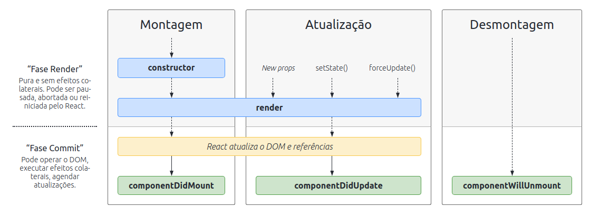

# Bloco 13 - Ciclo de Vida de Componentes e React Router

## Ciclo de vida de componentes

Um componente *React* possui quatro fases em seu ciclo de vida, sendo:
- Inicialização - quando o componente recebe as props e os estados;
- Montagem - quando o componente é inserido no DOM;
- Atualização - quando os props ou estados do componente são alterados;
- Desmontagem - quando o componente morre, sumindo do DOM.

[Font](https://projects.wojtekmaj.pl/react-lifecycle-methods-diagram/)

### Funções

- `componentDidMount()` dispara uma ou mais ações após o componente ser inserido no DOM (ideal para requisições) 
- `componentDidUpdate()` dispara uma ou mais ações após o componente ser atualizado
- `componentWillUnmount()` dispara uma ou mais ações antes de o componente ser desmontado
- `shouldComponentUpdate()` possibilita autorizar ou não o componente a atualizar
- *Outros métodos*: `getDerivedStateFromProps()`, `getSnapshotBeforeUpdate()`.

Implementação delas é semelhante ao do `render()`.

#### Next e Prev

Os parâmetros *nextProps* e *nextState* no `shouldComponentUpdate` e *prevProps* e *prevState* no `componentDidUpdate`, possibilitam acessar as *props* e *states*, próximos ou anteriores, dependendo da função utilizada.

## Links

- [Video do conteúdo](https://www.youtube.com/watch?v=m_mtV4YaI8c)
- [Explicação sobre os outros métodos menos utilziados](https://pt-br.reactjs.org/docs/react-component.html#static-getderivedstatefromprops)
- [API de Piadas](https://icanhazdadjoke.com/)
- [API Random User](https://api.randomuser.me/)
- [Onde devemos integrar chamadas de APIs?](https://pt-br.reactjs.org/docs/faq-ajax.html)

- [Video sobre React Lifecycle](https://www.youtube.com/watch?v=m_mtV4YaI8c)
- [Métodos Raramente Usados](https://pt-br.reactjs.org/docs/react-component.html#static-getderivedstatefromprops)
- [Métodos do ciclo de vida de componentes ReactJS — Um mergulho profundo!](https://medium.com/creditas-tech/m%C3%A9todos-do-ciclo-de-vida-de-componentes-reactjs-um-mergulho-profundo-332ed7b3b782)
- [Tutorial sobre Lifecycle](https://www.fullstackreact.com/30-days-of-react/day-7/)
- [Filas e pilhas em ES6](https://dev.to/dilantha111/stacks-and-queues-in-js-with-es6-classes-and-array-20kh)
- [Mais informações sobre Lifecycle](https://www.geeksforgeeks.org/reactjs-lifecycle-components/)
- [Visão detalhada de cada método de Ciclo de Vida do React](https://pt-br.reactjs.org/docs/react-component.html#commonly-used-lifecycle-methods)
