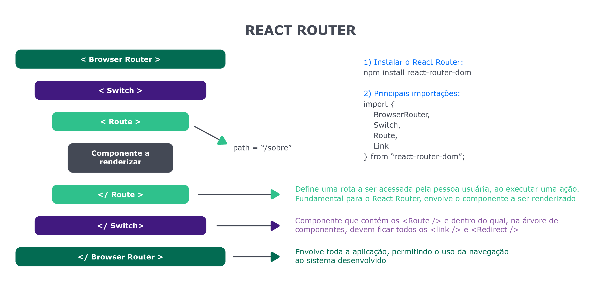

# Bloco 13 - Ciclo de Vida de Componentes e React Router

## React Router

### props.children

Quando criado um componente pai, com componentes filhos, o `props.children` permite pegar os componentes filhos, retornando um objeto (caso de único filho) ou um array de objetos. Exemplos:

Chamado do componente pai:

```
class App extends Component {
  render() {
    return (
      <div className='main'>
        <ComponentePai>
          <p>SUPIMPA</p>
        </ComponentePai>
      </div>
    )
  }
}
```

Dentro do componente pai:

```
const ComponentePai = (props) => {
  return (
    <div>
      {props.children}
    </div>
  )
}
```

Assim é possível manipular a tag `p` que foi passada ao chamar o componente, dentro do componente.

### React Router Dom

É necessário instalá-lo

```
npm install react-router-dom
```

[Repositório](https://github.com/ReactTraining/react-router/tree/master/packages/react-router-dom)

### BrowserRouter e Route

`BrowserRouter` é um componente que encapsula a aplicação e possibilita a navegação entre diferetes páginas. Não é nativo do *React*.
`Route` é um componente fundamental do *React Route*. Ele faz o mapeamento, ligando url e componente.
Pode ser feito destas formas:

- `<Route path="/about" component={About} />` se o caminho passado no `path` corresponder com `/about` no ínicio, ele renderiza o componente `About`. *Ele aceita substrings*, caso o path passado sejá uma substring presente na URL, ele renderiza o componente.

- `<Route exact path="/about" component={About} />` o `path` passado deve ser exato ao da url, impossibilitando que pegue substrings.

- Outras formas:

```
  <Route path="/about" >
    <About />
  </Route>
```

Lembrando que a aplicação (ou seja, o return do *App.js*) **deve estar encapsulado** dentro de um `<BrowserRouter> </BrowserRouter>` e os elementos `BrowserRouter`e `Route` **devem ser importados** da lib `react-router-dom`.

### Link

`<Link to="/caminho-url">Texto do Link</Link>` é quase igual ao *anchor* do Html, porém não necessita recarregar toda a página, inegrando assim a *single page application*. Lembrando de importá-lo da lib `react-router-dom`.
O `Link` aceita qualquer coisa (imagem,texto, outro componente,...) como filho, se clicar no filho, vai para a url dentro do `to=""`.

### Route

É possível associar um componente no `Route` via `children`, `component` ou `render`. Com o uso do `component`, não é necessário passar informações adicionais.
O `render` é utilizado quando precisa passar propriedades adicionais, via *props*. **Lembrando que ele recebe uma *callback***. Sintaxe:

```
<Route path="/" render={ (props) => <Home {...props} /> }>
```

A lib `react-router-dom` possui mecanismos internos que podem ser passados via *props*, como mostrado. Estas *props* armazenam três grandes conjuntos de dados, sendo: `match`, `location` e `history`. Eles podem ser passados e utilizados como *props* de um componente. Um exemplo é de utilizar parâmetros passados pela URL, como:

```
<Route path="/home/:parametro" />
```

No exemplo, o que vier após os `:` será armazenado na chave `parametro` e pode ser passado via *props*, ficando armazenado no `match`, espécificamente na chave `params`. Ou seja: `this.props.match.params.parametro`.

### Componente Switch

Utilizado para encapsular um conjunto de rotas, via `Route`. Cada a URL da aplicação, o `switch` procura de **cima para baixo** pelo primeiro `Route` que possuir correspondência com a URL passada. Sintaxe:

```
<Switch>
  <Route path="/about" component={About} />
  <Route path="/contact" component={Contact} />
  <Route path="/movies" component={Movies} />
  <Route path="/" component={Home} />
</Switch>
```

Assim apenas um componente é renderizado, este sendo o primeiro que for encontrado correspondência. Sem ele, mais de um componente poderia ser renderizado.
Só pode possuir como filhos componentes `Route` ou `Redirect`.

O `switch` pode ser utilizado como o bloco de código que será alterado com a entrada no link, como se fosse o conteúdo de uma página ao navegar pelo *header*. Ou seja, o *header* se mantem e o conteúdo/*switch* é alterado.

### Componente Redirect

Utilizado para *redirecionar* o usuário entre as páginas. Ao contrário do `Link`, não depende de interação de quem usa, ele acontece de forma automática. Exemplo: Usuário não logado tentando entrar em área restrita, ele é **automaticamente redirecionado a tela de login**.

### Mapa mental


[FONTE](https://www.betrybe.com/)

## Links

- [Handling 404 pages (catch all routes) with React Router v4](https://tylermcginnis.com/react-router-handling-404-pages/)
- [URL Parameters with React Router v4](https://tylermcginnis.com/react-router-url-parameters/)
- [Ambiguous Matches with React Router v4](https://tylermcginnis.com/react-router-ambiguous-matches/)
- [URL Parameters with React Router](https://tylermcginnis.com/react-router-url-parameters/)
- [React Router v4: Philosophy and Introduction](https://tylermcginnis.com/react-router-philosophy-introduction/)
- [Documentação do React Router](https://reacttraining.com/react-router/web/guides/quick-start)
- [prop match disponbilizada pelo componente Route](https://reacttraining.com/react-router/web/api/match)
- [prop location disponbilizada pelo componente Route](https://reacttraining.com/react-router/web/api/location)
- [prop history disponbilizada pelo componente Route](https://reacttraining.com/react-router/web/api/history)
- [A Simple React Router v4 Tutorial](https://blog.pshrmn.com/simple-react-router-v4-tutorial/)
- [React Fragments](https://reactjs.org/docs/fragments.html)