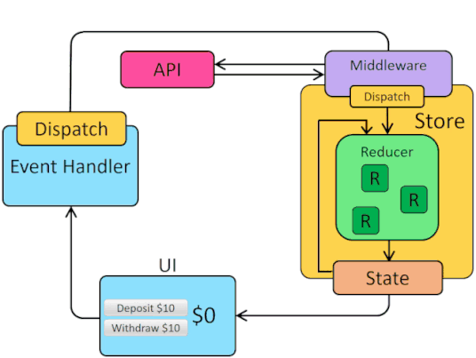

# Bloco 16 - Gerenciamento de estado com Redux

## Usando o Redux no React - Actions Assíncronas

### redux-thunk

[Repositório e documentação](https://github.com/reduxjs/redux-thunk). O `redux-thunk` é im *middleware* que intercepta a *action* antes que ela chegue no *reducer*, garantindo assim que o retorno de funções assíncronas possam ser armazenados na *store*.
É preciso instalá-lo:

```
npm install redux-thunk
```

E é necesspario utilizar a função `applyMiddleware()` do Redux. Exemplo:

```
// arquivo onde a redux store é criada
import { createStore, applyMiddleWare } from 'redux';
import thunk from 'redux-thunk';
import reducer from '/path/to/your/root/reducer';

...

const store = createStore(reducer, applyMiddleware(thunk));
...
```

O `redux-thunk` possibilita que o *action creator* retorne uma função, na função retornada é possível realizar uma operação assíncrona. E, ao final da operação, é possível enviar uma *action* com o retorno, os dados obtidos.
Contexto:

```
export const REQUEST_MOVIES = 'REQUEST_MOVIES';
export const RECEIVE_MOVIES = 'RECEIVE_MOVIES';

// action creator que retorna um objeto, que você tem feito até então
const requestMovies = () => ({
  type: REQUEST_MOVIES});

// outro action creator que retorna um objeto, que você tem feito até então
const receiveMovies = (movies) => ({
  type: RECEIVE_MOVIES,
  movies});

// action creator que retorna uma função, possível por conta do pacote redux-thunk
export function fetchMovies() {
  return (dispatch) => { // thunk declarado
    dispatch(requestMovies());
    return fetch('alguma-api-qualquer.com')
      .then((response) => response.json())
      .then((movies) => dispatch(receiveMovies(movies)));
  };
}

// componente onde você usaria a action creator fetchMovies assíncrona como uma outra qualquer
...
class MyConectedAppToRedux extends Component {
  ...
  componentDidMount() {
    const { dispatch, fetchMovies } = this.props;
    dispatch(fetchMovies()); // enviando a action fetchMovies
  }
  ...
}
...
```



Extraído de: redux.js.org/tutorials/fundamentals/part-6-async-logic

## Links

- [Funções Puras](https://medium.com/nossa-coletividad/redux-e-reducers-a-m%C3%A1gica-das-fun%C3%A7%C3%B5es-puras-65e5beb093d8)
- [Terceiro argumento para a função retornada](https://github.com/reduxjs/redux-thunk#injecting-a-custom-argument)

- [Redux - Middleware](https://redux.js.org/advanced/middleware)
- [What the heck is a 'thunk'?, por Dave Ceddia](https://daveceddia.com/what-is-a-thunk)
- [Redux Thunk, por Davi Felipe](http://davifelipe.com.br/redux-thunk)
- [React Redux, por Davi Felipe, com o código usado no artigo anterior](http://davifelipe.com.br/react-redux)
- [Redux Thunk - Why do I need this?](https://github.com/reduxjs/redux-thunk#why-do-i-need-this)
- [Redux - Async Actions](https://redux.js.org/advanced/async-actions)
- [Redux - Async Flow](https://redux.js.org/advanced/async-flow)
- [Redux - Usage with React Router](https://redux.js.org/advanced/usage-with-react-router)
- [GitHub - Awesome Redux](https://github.com/xgrommx/awesome-redux)
- [Redux - API Reference](https://redux.js.org/api/api-reference)
- [Redux e Reducers: A mágica das funções puras](https://medium.com/nossa-coletividad/redux-e-reducers-a-m%C3%A1gica-das-fun%C3%A7%C3%B5es-puras-65e5beb093d8)
