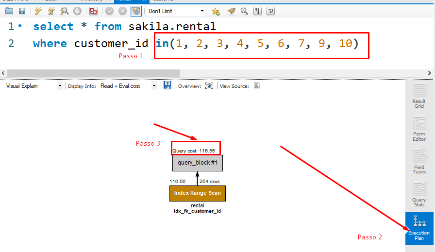

# Bloco 20 - Introdução à SQL

## Filtrando dados de forma específica

- `WHERE`: Coloca uma condicional para o retorno. Ou seja, só será mostrado o que bate com o `WHERE`.

  | Operador | Descrição |
  | -------- | --------- |
  | = | IGUAL |
  | <> | DIFERENTE DE |
  | > | MAIOR QUE |
  | < | MENOR QUE |
  | >= | MAIOR QUE OU IGUAL A |
  | <= | MENOR QUE OU IGUAL A |
  | AND | OPERADOR LÓGICO E |
  | OR | OPERADOR LÓGICO OU |
  | IS | COMPARA COM VALORES BOOLEANOS (TRUE, FALSE, NULL) |
  | NOT | NEGAÇÃO |

- `LIKE`: Utilizado com o `WHERE`, busca o padrão específico passo. Exemplos:

  | LIKE Operator |	Description |
  | ------------- | ----------- |
  | WHERE CustomerName LIKE 'a%' | Finds any values that start with "a" |
  | WHERE CustomerName LIKE '%a' |	Finds any values that end with "a" |
  | WHERE CustomerName LIKE '%or%' |	Finds any values that have "or" in any position |
  | WHERE CustomerName LIKE '_r%' |	Finds any values that have "r" in the second position |
  | WHERE CustomerName LIKE 'a_%' |	Finds any values that start with "a" and are at least 2 characters in length |
  | WHERE CustomerName LIKE 'a__%' |	Finds any values that start with "a" and are at least 3 characters in length |
  | WHERE ContactName LIKE 'a%o' |	Finds any values that start with "a" and ends with "o" |
  Font: [W3Schools](https://www.w3schools.com/sql/sql_like.asp)

```
-- Encontra qualquer resultado finalizando com "don"
SELECT * FROM sakila.film
WHERE title LIKE '%don';

-- Encontra qualquer resultado iniciando com "plu"
SELECT * FROM sakila.film
WHERE title LIKE 'plu%';

-- Encontra qualquer resultado que contém "plu"
SELECT * FROM sakila.film
WHERE title LIKE '%plu%';

-- Encontra qualquer resultado que inicia com "p" e finaliza com "r"
SELECT * FROM sakila.film
WHERE title LIKE 'p%r';

-- Encontra qualquer resultado em que o segundo caractere da frase é "C"
SELECT * FROM sakila.film
WHERE title LIKE '_C%';

-- Encontra qualquer resultado em que o título possui exatamente 8 caracteres
SELECT * FROM sakila.film
WHERE title LIKE '________';

-- Encontra todas as palavras com no mínimo 3 caracteres e que iniciam com E
SELECT * FROM sakila.film
WHERE title LIKE 'E__%';
```

Fonte: [Trybe](https://www.betrybe.com/)

- **Ordem dos operadores**:
  Parênteses > Divisão/Multiplicação > Subtração/Adição > NOT > AND > OR

### Operadores IN e BETWEEN

- `IN`: A comparação é sobre um conjunto de valores (similar ao `INCLUDE`).

```
SELECT * FROM sakila.actor
WHERE first_name IN ('PENELOPE','NICK','ED','JENNIFER');

SELECT * FROM sakila.customer
WHERE customer_id in (1, 2, 3, 4, 5);

SELECT * FROM banco_de_dados
WHERE coluna IN (valor1, valor2, valor3, valor4, ..., valorN);

-- ou também
SELECT * FROM banco_de_dados
WHERE coluna IN (expressão);
```

- `BETWEEN`: Utilizado para fazer pesquisas entre uma faixa inicial e final. Aceita tambem *strings* e datas (**YYYY-MM-DD HH:MM:SS**).

```
expressão BETWEEN valor1 AND valor2;
-- a expressão é a sua query
-- e valor1 e valor2 delimitam o resultado

-- Note que o MySQL inclui o valor inicial e o final nos resultados
SELECT title, length FROM sakila.film
WHERE length BETWEEN 50 AND 120;

SELECT * FROM sakila.language
WHERE name BETWEEN 'Italian' AND 'Mandarin'
ORDER BY name;

SELECT rental_id, rental_date FROM sakila.rental
WHERE rental_date
BETWEEN '2005-05-27' AND '2005-07-17';
```

- `IN` VS `BETWEEN`: No `IN` precisa especificar os valores, no `BETWEEN` não.

### Datas

O Formato padrão é **YYYY-MM-DD HH:MM:SS**. Exemplos de pesquisa:

```
-- Encontra todos os pagamentos deste dia, ignorando horas, minutos e segundos
SELECT * FROM sakila.payment
WHERE DATE(payment_date) = '2005-07-31';

-- Encontra todos pagamentos deste dia, ignorando horas, minutos e segundos
SELECT * FROM sakila.payment
WHERE payment_date LIKE '2005-07-31%';

-- Encontra um pagamento com dia e hora exatos
SELECT * FROM sakila.payment
WHERE payment_date LIKE '2005-08-20 00:30:52';

-- Encontra pagamentos especificando um valor mínimo e um valor máximo para a data
SELECT *
FROM sakila.payment
WHERE payment_date BETWEEN '2005-05-26 00:00:00' AND '2005-05-27 23:59:59';
```

- Selecionar apenas partes d euma data:

```
-- Teste cada um dos comandos a seguir:
SELECT DATE(payment_date) FROM sakila.payment; -- YYYY-MM-DD
SELECT YEAR(payment_date) FROM sakila.payment; -- Ano
SELECT MONTH(payment_date) FROM sakila.payment; -- Mês
SELECT DAY(payment_date) FROM sakila.payment; -- Dia
SELECT HOUR(payment_date) FROM sakila.payment; -- Hora
SELECT MINUTE(payment_date) FROM sakila.payment; -- Minuto
SELECT SECOND(payment_date) FROM sakila.payment; -- Segundo
```

### Performace

O MySQL Workbench tem uma ferramenta para medir a performace do código, é o *Execution Plan*.



Fonte: [Trybe](https://www.betrybe.com/)

## Links

- [Tipos de dados SQL](https://www.mysqltutorial.org/mysql-data-types.aspx)
- [Quiz prêmio nobel com MySQL](https://sqlzoo.net/wiki/Nobel_Quiz)
- [Desafios do HackerRank sobre conhecimentos básicos](https://www.hackerrank.com/domains/sql?filters%5Bsubdomains%5D%5B%5D=select)
- [Lidando com datas no MySQL](https://popsql.com/learn-sql/mysql/how-to-query-date-and-time-in-mysql/)
- [Recursos para aprender e praticar SQL](https://www.w3resource.com/mysql/mysql-tutorials.php)
- [Dates are more troublesome than they seem!](https://www.youtube.com/watch?v=-5wpm-gesOY)
