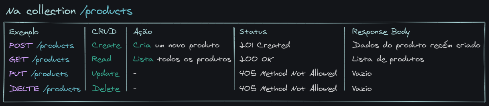
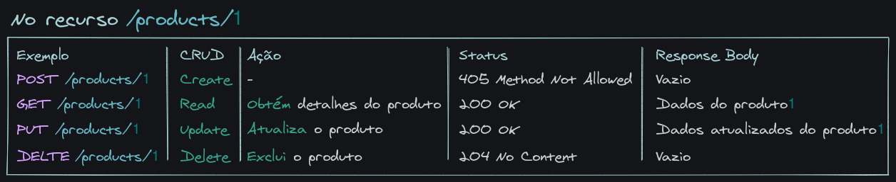

# Bloco 26 - NodeJS: Camada de Serviço e Arquitetura Rest e Restful

## Arquitetura Web - Rest e Restful

* *RESTful*: é um *web service* que segue as regras definicas pelo *REST*.
* *REST*:

> Representational State Transfer (REST), em português Transferência de Estado Representacional, é um estilo de arquitetura de software, controlado pelo W3C , que define um conjunto de restrições a serem usadas para a criação de APIs.

Ou seja, *REST* é um conjunto de boas práticas para o desenvolvimento de APIs. No contexto do *REST*, uma palicação é um conjunto de recursos que podem ter seu estado representado de alguma forma. Ao transferir as informações desses estados, a API está sendo consumida. Sendo isso a *'Transferência de Estado Representacional'*.

Um **Recurso** é uma abstração da informação. Qualquer coisa que possa ser nomeada pode ser um recurso. Ex.: Usuários, Produtos, Compras, ...

## As 6 restrições para ser RESTful

A arquitetura REST define seis restrições, chamadas constraints , que devem ser respeitadas para que sua API seja RESTful .

### 1 - Interface uniforme ( Uniform Interface )

Coloca a obrigação de seguir um padrão de interface de comunicação entre Cliente e Servidor. Isso gera uma arquitetura simplificada e desacoplada. Essa interface inclui o **endpoint**, o **tipo de retorno** e o uso dos **verbos HTTP**.

#### Recursos e coleções

O recurso a ser acessado/modificado deve ser identificado no *endpoint* da requisição. Exemplo: `https://swapi.dev/api/planets/:id`, onde o recurso que queremos acessar é `planet`. Plural ou singular não importa, o importante é manter o padrão.

#### Tipo de retorno

Há um *header* chamado `Content-type`, ele informa qual tipo de conteúdo está sendo retornado. Exemplo com *JSON*: `Content-type: application/json`. Exemplo com *HTML*: `Content-type: text/html`. Formatos comuns: JSON , XML e JavaScript.
Ou seja, se o cliente pede (ou envia) informações no formato *JSON*, esse tipo de retorno deve ser mantido em todos os *endpoints* daquela coleção.

> Se, por exemplo, quando realizamos uma requisição GET /products , recebemos um array de produtos, ao realizar a requisição GET /sales , não devemos receber um JSON no formato { "sales": [{ ... }] } , já que esse comportamento é inconsistente com o do endpoint GET /products .

#### Ações/Verbos

A ação a ser executada deve ser identificada pelo verbo *HTTP* condizente. Os principais verbos são: `POST`, `GET`, `PUT` e `DELETE`, cada um realizando um tipo específico de ação. Esses verbos derivam até mesmo na manipulação de recurso e coleção, sendo:





#### Respostas

**SEMPRE OBRIGATÓRIAS**. Existindo boas práticas em relação ao código da resposta (*status code*).

* 1xx: Informação;
* 2xx: Sucesso;
* 3xx: Redirecionamento;
* 4xx: Erro do cliente;
* 5xx: Erro no servidor.

[Lista Completa](https://developer.mozilla.org/pt-BR/docs/Web/HTTP/Status)

### 2 - Arquitetura cliente-servidor

A API deve ser desacoplada do cliente. Não importa quem seja o cliente, a API deve ser capaz de retornar uma resposta para ele.
O princípio básico é a separação de responsabildiades em duas partes:

> O cliente se preocupa com a exibição dos dados, experiência da pessoa usuária, etc. O servidor se preocupa com armazenamento e acesso dos dados, cache, log e por aí vai.

### 3 - Sem estado ( Stateless )

> Não manter estado significa que **toda requisição deve conter todas as informações necessárias (ser autossuficiente) para nossa API realizar uma ação** . Desse jeito, não podemos reutilizar nenhum contexto que está armazenado no servidor (uma variável, por exemplo).

Para realizar isso, pode se usar *tokens*. Ao fazer o *login* o servidor responde com um *token*, que é utilziado em todas as requisições seguintes do cliente. Assim a requisição vai com todas as informações, não dependendo de ser salvo valores específicos daquele cliente no servidor. Vantagens:

* Transparência : facilita o trabalho do lado do servidor, pois todas as informações necessárias já estão na requisição;
* Escalabilidade : sem precisar manter estado, nosso servidor pode desalocar recursos que foram alocados para realizar uma ação específica e alocá-los apenas quando necessário.

### 4 - Cacheable

*Cache* é um depósito de informações, que armazena o dados com o intuito de não precisar solicitá-los novamente ao servidor. No lado do servidor, essa regra implica que informações que podem ser guardadas em *cache*, devem ser especificadas nas respostas da API, dizendo se podem ou não ser cacheadas e por quanto tempo.
Para isso utilizamos um *header* específico:


```
Cache-Control: max-age=120
```

**OBS.**: O *cache* será salvo por 120 segundos. Durante esse tempo o cliente fornecerá as respostas cacheadas, sem precisar acessar o servidor.

#### 5 - Sistema em camadas ( Layered System )

**Não** tem a ver, **diretamente**, com a organização do código. Mas sim em abstrair do cliente camadas necessárias para responder a uma requisição.
Ou seja, quem consome a API não precisa saber onde a informação está guardada, só precisa receber a resposta esperada.

#### 6 - Código sob demanda ( Code on Demand )

*Item opcional*.

> Esse princípio consiste em dar a possibilidade de o nosso servidor enviar código (JavaScript, por exemplo) ao nosso cliente, onde será executado. Assim, você consegue customizar o comportamento do cliente.
> Um exemplo prático: enviar um "widget" para colocar na página um chat para que o cliente possa conversar com alguém.
> Você não precisa implementar código sob demanda para ser RESTful, logo esse item é considerado opcional.

## Links

* [What is REST](https://restfulapi.net/)
* [What are Resources](https://restful-api-design.readthedocs.io/en/latest/resources.html)
* [Software Architecture Guide - Martin Fowler](https://martinfowler.com/architecture/)
* [Arquitetura Multicamadas](https://pt.wikipedia.org/wiki/Arquitetura_multicamada)
* [Lista de MIME Types no MDN](https://developer.mozilla.org/pt-BR/docs/Web/HTTP/Basico_sobre_HTTP/MIME_types)
* [Documentação do Content-Type no MDN](https://developer.mozilla.org/pt-BR/docs/Web/HTTP/Headers/Content-Type)
