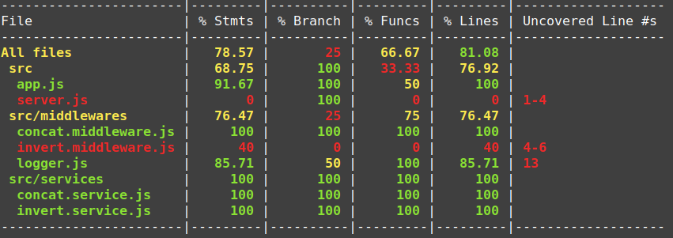

# Bloco 27 - Autenticação e Upload de Arquivos

## NodeJS - Testando APIs com Testes de Integração

Verifica se a comunicação entre os componentes de um sistema está ocorrendo do modo adequado. Ele testa a integração entre todas as unidades.

### Chai HTTP

Plugin para simular requisições HTTP para a api.

```
npm install -D chai-http
```

Para adicionar isso aos testes:

```
const chai = require('chai');
const chaiHttp = require('chai-http');

chai.use(chaiHttp);

const { expect } = chai
```

Com esse plugin é possível consumir o servidor sem a necessidade de subir a API manualmente. Basta importar a API e passar ela como parâmetro ao método `request` do *chai*. Algo assim:

```
// const chai = require('chai');
// const chaiHttp = require('chai-http');
const server = require('../src/api/app');

// chai.use(chaiHttp);

// const { expect } = chai;

// describe('POST /api/users', () => {
//     describe('quando é criado com sucesso', () => {
//        let response = {};

        before(async () => {
            response = await chai.request(server);
        });

        /*
            Veremos adiante o exemplo completo 😉
        */
//    });
//});
```

> Nesse caso, uma boa prática para a arquitetura da API, é fazer a separação** do conjunto da definição das rotas e regras de middlewares** (Em um arquivo app.js , por exemplo. Que vai ser consumido pelo chaiHttp ) , do servidor propriamente dito, que consome essas regras (Esse continuaria em server.js , para utilizarmos em contextos de não-teste)

```
// ./src/api/app.js
const express = require('express');
const bodyParser = require('body-parser');
const routes = require('./routes');

const app = express();

app.use(bodyParser.urlencoded({ extended: false }));
app.use(bodyParser.json());

const apiRoutes = express.Router();
apiRoutes.get('/api/posts', routes.getPosts);
apiRoutes.post('/api/users', routes.createUsers);
apiRoutes.post('/api/login', routes.login);

app.use(apiRoutes);

/*
    Detalhe para a exportação do `app`, já que
    precisaremos dele nos testes com `chaiHttp`
*/
module.exports = app;
```
```
// ./src/api/server.js
const PORT = process.env.PORT || 8080;
const app = require('./app');

app.listen(PORT, () => console.log(`Conectado na porta ${PORT}`));
```

Feito essas configurações, é possível utilizar o método `request` do chai para chamar os endpoints., simulando chamadas HTTP.

```
/*
    Podemos chamar um `GET` que deve consumir nossa api,
    sem que pra isso precisemos subir ela manualmente
*/
const response = await chai.request(server)
  .get('/exemplo');

/*
    Da mesma forma, podemos chamar um `POST` passando um
    `body` e/ou um `header`, por exemplo:
*/
const response = await chai.request(server)
  .post('/favorite-foods')
  .set('X-API-Key', 'foobar')
  .send({
      name: 'jane',
      favoriteFood: 'pizza'
  });
```

#### Exemplo de teste

```
const chai = require('chai');
const chaiHttp = require('chai-http');

const server = require('../src/api/app');

chai.use(chaiHttp);

const { expect } = chai;

describe('POST /api/users', () => {
    describe('quando é criado com sucesso', () => {
        let response = {};

        before(async () => {
            response = await chai.request(server)
                .post('/api/users')
                .send({
                    username: 'jane',
                    password: 'senha123'
                });
        });

        it('retorna o código de status 201', () => {
            /*
                Perceba que aqui temos uma asserção
                específica para o status da `response` 😬
            */
            expect(response).to.have.status(201);
        });

        it('retorna um objeto', () => {
            expect(response.body).to.be.a('object');
        });

        it('o objeto possui a propriedade "message"', () => {
            expect(response.body).to.have.property('message');
        });

        it('a propriedade "message" possui o texto "Novo usuário criado com sucesso"',
            () => {
                expect(response.body.message)
                    .to.be.equal('Novo usuário criado com sucesso');
            }
        );
    });
});
```

**OBS.**: O `.send()` envia informações pelo *body*, o `.set()` envia pelo *header*. Isso no `await chai.request(server)`.

### Cobertura de testes

É possível gerar relatórios de cobertura de testes com a ferramenta [nyc](https://github.com/istanbuljs/nyc). Os [critérios para esse relatório](https://en.wikipedia.org/wiki/Code_coverage#Basic_coverage_criteria).

> Cobertura de Funções / Function Coverage : Cada função/sub-rotina do script foi acionado/chamado?

> Cobertura de Afirmações / Statement Coverage : Cada afirmação/definição/comando do script foi executado?

> Cobertura de Ramificações / Branch Coverage : Cada situação de ramificação do código (aqui podemos assumir um script condicional, como um if { /*situação A*/ } else { /*situação B*/ } ) foi executada?

Tanto o *nync* quanto o *jest*, geram o relatório no formato [Instanbul](https://istanbul.js.org/).



Onde:

> File (Arquivo): Retorna a estrutura do escopo analisado, cada linha é referente a pasta ou arquivo específico, no nosso caso, a cobertura esta analisando todos arquivos *.js contidos em ./src , que fica na raiz do projeto;

> Stmts (Statements/Afirmações): Retorna os percentuais da cobertura de afirmações executadas que citamos anteriormente, no nosso caso, é possível assumir que o arquivo middlewares/invert.middleware.js não executou todas as suas definições/afirmações . Note ainda, que em Uncovered Line #s (Linhas não-cobertas) , o relatório identifica quais as linhas do arquivo não foram executadas, no nosso caso, as linhas de 4 a 6 não foram executadas em nenhum momento quando esse arquivo foi referenciado nos nossos testes (via require() , ou via parâmetro de configuração, o que veremos mais a frente);

> Branch (Ramo): Retorna o percentual de situações de ramificação cobertos . Se observarmos no arquivo logger.js , existe um percentual de 50% de situações não-cobertas (ou seja, situações que não foram testadas em nenhum momento), o relatório ainda aponta a linha 13 como a linha não-coberta, aqui podemos assumir que essa linha faz parte do resultado de um script condicional (como um if{}else ). Se no arquivo não houverem situações de ramificação, o retorno é 100% .
OBS: É considerado `branch`mesmo que não exista um `else`.

> Funcs (Functions/Funções): Retorna o percentual de funções executadas nos arquivos. Em middlewares/invert.middleware.js e server.js , podemos assumir que nenhuma das funções desses arquivos foi executada nos nossos testes. Em server.js , ainda, é possível identificar que o arquivo não foi nem mesmo referenciado nos testes, já que nenhuma definição do mesmo foi executada (Coluna % Stmts );

> Lines (Linhas): Retorna o percentual de linhas executadas nos arquivos, no caso de All files , esse valor representa o total de cobertura da sua suite de testes , que no nosso caso representa 81,08% de cobertura total, dado os problemas apresentados.

## Links

- [Chai HTTP](https://www.chaijs.com/plugins/chai-http/)
- ["teste de mesa"](https://pt.stackoverflow.com/questions/220474/o-que-%C3%A9-um-teste-de-mesa-como-aplic%C3%A1-lo)
- [Instanbul](https://istanbul.js.org/)
