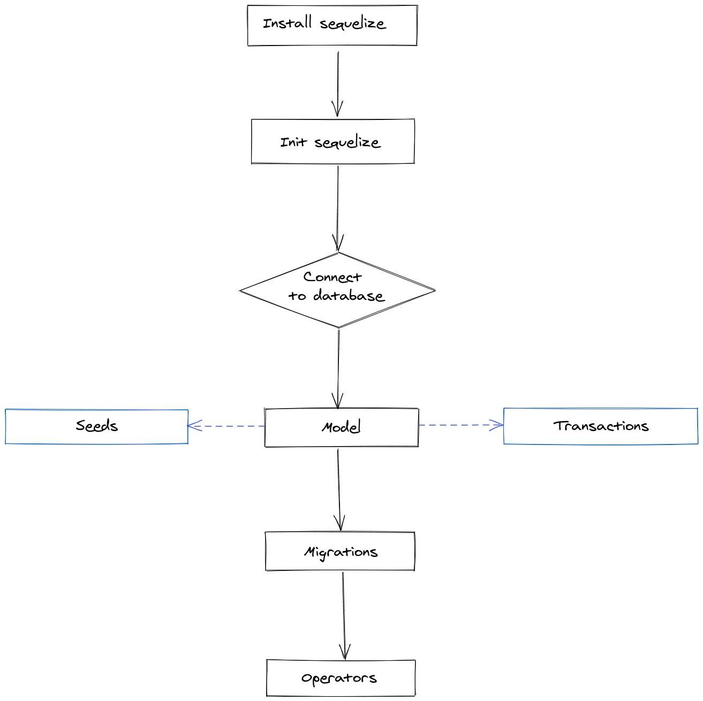

# Bloco 29 - Arquitetura: SOLID e ORM

## ORM - Interface da aplicação com o banco de dados

* **ORM** (*Object Relational Mapper*): Camada de mapeamento que permite relacionar a estrutura de dados da aplicação com os dados do banco de dados.
* Abstrai as diferenças entre dois paradigmas: da aplicação e do banco de dados.


* Uma lib que faz isso: *Sequelize*. Suporta: PostgreSQL, MariaDB, MySQL, SQLite e Microsoft SQL Server.

## Mapeamentos

* Dois padrões: **Data Mapper** e **Active Record**.
  - Definidos por *Martin Fowler* em *Padrões de Arquitetura de Aplicações Corporativas*

### Data Mapper

* Classe que representa a tabela do banco não deve conhecer os recursos necessários para realizar as transações com o banco.


> No Data Mapper , como podemos ver acima, a entidade Pessoa está desacoplada do banco de dados. As informações e os comportamentos relacionadas à Pessoa no contexto específico do nosso negócio ficam em um lugar, e em um outro, o Mapeador Pessoa , temos a camada responsável por criar as transações das informações com o banco de dados.

* *Mapeador Pessoa* -> fortemente acoplado ao banco.
  - Devendo ser refatorado ou refeito toda a vez que houver mudanças na estrutura do banco.
* Entidade *Pessoa* é completamente independente do banco.
  - Complexidade absorvida pelo mapeador.

### Active Record

* Classe que representa a tabela conhece os recursos do banco.


> No Active Record o model está diretamente acoplado ao banco de dados. Dessa forma, o nosso próprio model descreve as operações do banco de dados e tem conhecimento de como salvar os dados, atualizá-los, deletá-los etc.

## Sequelize

* Maioria dos métodos é assíncrono.
> Usando o Sequelize, você pode evitar a criação de queries SQL e utilizar models e migrations para criar as tabelas em vez de um script SQL separado.
* Código mais legível, extensível e de fácil manutenção.
* Criar as relações e associações entre tabelas pelo próprio JS, no *Active Record*.
* Possibilita migrar a base de dados para outro banco sem precisar reescrever o código.



### Configurando

* **Instalação**
```
npm install sequelize

// Gera e executa as operações
npm install sequelize-cli

// Dependência do Banco
npm install mysql2
```

* **Iniciar um projeto do Sequelize**
```
npx sequelize-cli init
```
  - Comando cria as pastas:
    * `config` : contém um arquivo de configuração, que "fala" para o CLI como conectar-se com o nosso banco de dados;
    * `models` : contém todos os modelos da nossa aplicação;
    * `migrations` : contém todos os arquivos de migração da nossa aplicação;
    * `seeders` : contém todos os arquivos de "seeds".

* **Conectando com o banco**
  * Configurar o arquivo: `config/config.json`
    - Somente o objeto `development`.
  ```
  {
    "development": {
      "username": "root",
      "password": "",
      "database": "orm_example",
      "host": "127.0.0.1",
      "dialect": "mysql"
    }

    // No resto do arquivo você vai encontrar as convenções para conectar o Sequelize em outros ambientes
  }
  ```
    * Usuário de acesso ao banco de dados;
    * Senha de acesso ao banco de dados;
    * Nome do banco de dados no qual queremos conectar;
    * Host que estamos conectando - por ser local, utilizamos o 127.0.0.1 ;
    * Dialect é, nada mais nada menos, qual banco estamos utilizando. Dito isso, passamos "mysql".

* **Criando o Banco de Dados via CLI**
  ```
   npx sequelize db:create
  ```

### Model

* Na pasta `models`, existe um arquivo `index.js`. Sua função é estabelecer uma isntância de conexão entre os arquivos presentes na pasta e o banco. **NÃO APAGUE ESSE ARQUIVO**.
* EssÊncia do *Sequelize*.
  - Abstração que representa uma linha na tabela.
* 2 modos de criação:
  - Chamando pela função `sequelize.define(modelName, attributes, options)`.
  - Estendendo *Model* como uma classe e chamando `init(attributes, options)`.

> A segunda forma é a padrão para utilização do sequelize, gerada automaticamente quando utilizado os comandos do CLI, e é específica para programação Orientada a Objetos .

* Utilizaremos mais a primeira forma.
* **Criando um model (template)**
  ```
   npx sequelize model:generate --name NomeDoModel --attributes nomeDoAtributo:string
  ```
  - Além do `model`, gera o `migration`, que cria a tabela no banco.

  > O parâmetro `--name` se refere ao nome da tabela, mas no singular, pois se refere a uma unidade dos dados, como uma linha no banco ou um objeto no seu código javascript;

  > O parâmetro `--attributes` se refere ao nome das colunas e os tipos de dados que ela contém. Não é preciso definir todas as colunas neste comando, é possível adicioná-las direto no arquivo `model.js` gerado e na migration equivalente a este model.

  * Depos de executado o comando, são criados arquivos na pasta `model` e na pasta `migration`.
    - No segundo, os números, no início do nome do arquivo, significam a data e a hora de criação dele, seguindo o formato `yyyy-MM-dd:hh:mm:ss`.
* **Substituir o arquivo criado**
  - Por estarmos trabalhando com funções, é necessário adaptar o arquivo criado em `model`. Para algo semelhante a:
  ```
  const User = (sequelize, DataTypes) => {
    const User = sequelize.define("User", {
      fullName: DataTypes.STRING,
      email: DataTypes.STRING,
    });

    return User;
  };

  module.exports = User;
  ```
    - No exemplo foi adicionado mais um atributo a entidade, o `email`.

> Agora, a imagem abaixo mostra o nosso model e migration criados. Perceba que o nome do arquivo model é user.js , o nome da função model definida está no singular User e na migration a tabela foi nomeada como Users .


> Um ponto **importante** de mudança estrutural que o sequelize traz é que, da forma que aprendemos antes, sem o sequelize, nossa lógica de validações, interação com o banco de dados (get, insert etc.), entre outras, se centralizavam no model. Com o Sequelize, essa lógica se centraliza nos controllers ou services. O modelo fica responsável apenas por representar a estrutura do banco de dados, para ajudar o sequelize a realizar as operações.

## Links