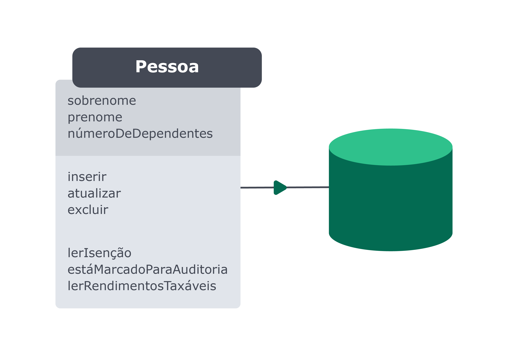

# Bloco 29 - Arquitetura: SOLID e ORM

## ORM - Interface da aplicação com o banco de dados

* **ORM** (*Object Relational Mapper*): Camada de mapeamento que permite relacionar a estrutura de dados da aplicação com os dados do banco de dados.
* Abstrai as diferenças entre dois paradigmas: da aplicação e do banco de dados.


* Uma lib que faz isso: *Sequelize*. Suporta: PostgreSQL, MariaDB, MySQL, SQLite e Microsoft SQL Server.

## Mapeamentos

* Dois padrões: **Data Mapper** e **Active Record**.
  - Definidos por *Martin Fowler* em *Padrões de Arquitetura de Aplicações Corporativas*

### Data Mapper

* Classe que representa a tabela do banco não deve conhecer os recursos necessários para realizar as transações com o banco.


> No Data Mapper , como podemos ver acima, a entidade Pessoa está desacoplada do banco de dados. As informações e os comportamentos relacionadas à Pessoa no contexto específico do nosso negócio ficam em um lugar, e em um outro, o Mapeador Pessoa , temos a camada responsável por criar as transações das informações com o banco de dados.

* *Mapeador Pessoa* -> fortemente acoplado ao banco.
  - Devendo ser refatorado ou refeito toda a vez que houver mudanças na estrutura do banco.
* Entidade *Pessoa* é completamente independente do banco.
  - Complexidade absorvida pelo mapeador.

### Active Record

* Classe que representa a tabela conhece os recursos do banco.



> No Active Record o model está diretamente acoplado ao banco de dados. Dessa forma, o nosso próprio model descreve as operações do banco de dados e tem conhecimento de como salvar os dados, atualizá-los, deletá-los etc.

## Sequelize

* Maioria dos métodos é assíncrono.
> Usando o Sequelize, você pode evitar a criação de queries SQL e utilizar models e migrations para criar as tabelas em vez de um script SQL separado.
* Código mais legível, extensível e de fácil manutenção.
* Criar as relações e associações entre tabelas pelo próprio JS, no *Active Record*.
* Possibilita migrar a base de dados para outro banco sem precisar reescrever o código.


### Configurando

* **Instalação**
```
npm install sequelize

// Gera e executa as operações
npm install sequelize-cli

// Dependência do Banco
npm install mysql2
```

* **Iniciar um projeto do Sequelize**
```
npx sequelize-cli init
```
  - Comando cria as pastas:
    * `config` : contém um arquivo de configuração, que "fala" para o CLI como conectar-se com o nosso banco de dados;
    * `models` : contém todos os modelos da nossa aplicação;
    * `migrations` : contém todos os arquivos de migração da nossa aplicação;
    * `seeders` : contém todos os arquivos de "seeds".

* **Conectando com o banco**
  * Configurar o arquivo: `config/config.json`
    - Somente o objeto `development`.
  ```
  {
    "development": {
      "username": "root",
      "password": "",
      "database": "orm_example",
      "host": "127.0.0.1",
      "dialect": "mysql"
    }

    // No resto do arquivo você vai encontrar as convenções para conectar o Sequelize em outros ambientes
  }
  ```
    * Usuário de acesso ao banco de dados;
    * Senha de acesso ao banco de dados;
    * Nome do banco de dados no qual queremos conectar;
    * Host que estamos conectando - por ser local, utilizamos o 127.0.0.1 ;
    * Dialect é, nada mais nada menos, qual banco estamos utilizando. Dito isso, passamos "mysql".

* **Criando o Banco de Dados via CLI**
  ```
   npx sequelize db:create
  ```

## Links