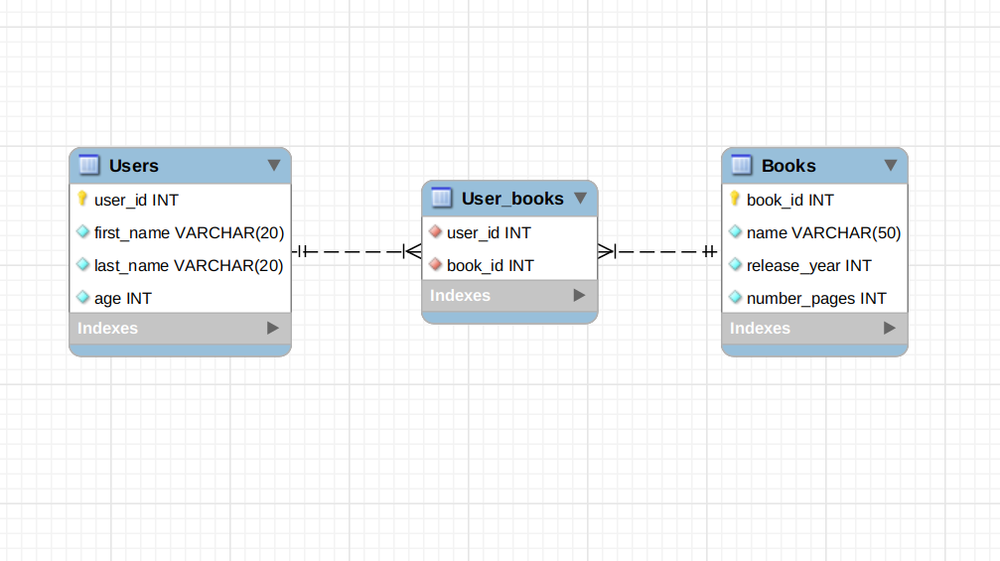
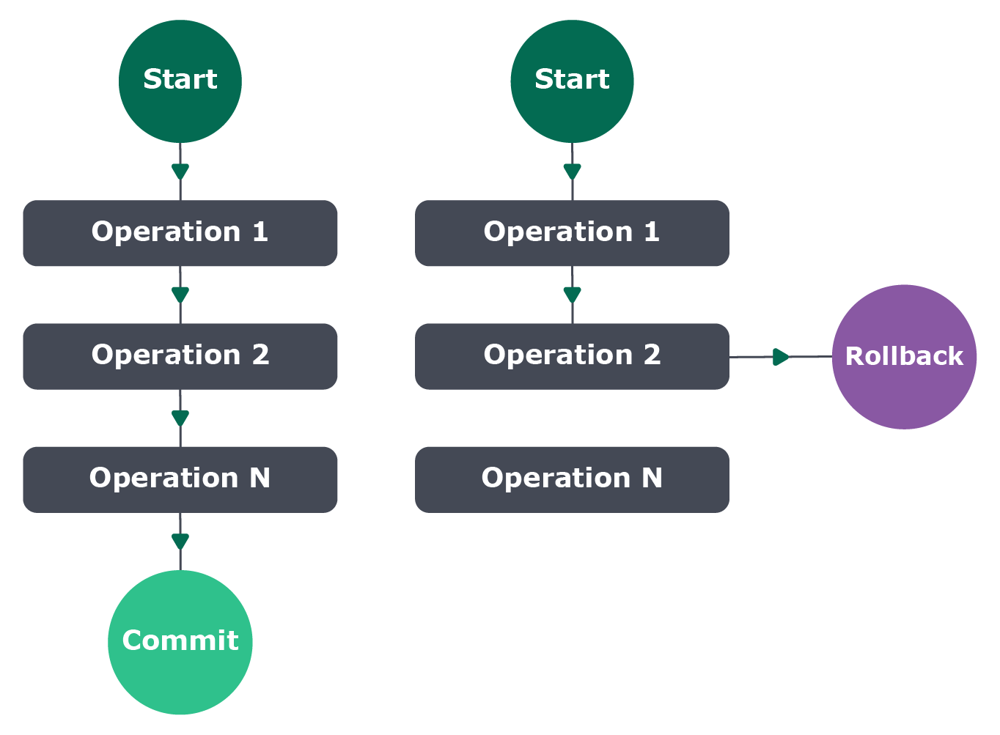

# Bloco 29 - Arquitetura: SOLID e ORM

## ORM - Associations

## Relacionamentos 1:1


* Exemplo

```
module.exports = {
  up: async (queryInterface, Sequelize) => {
    return queryInterface.createTable('Addresses', {
      id: {
        allowNull: false,
        autoIncrement: true,
        primaryKey: true,
        type: Sequelize.INTEGER,
      },
      city: {
        allowNull: false,
        type: Sequelize.STRING,
      },
      street: {
        allowNull: false,
        type: Sequelize.STRING,
      },
      number: {
        allowNull: false,
        type: Sequelize.INTEGER,
      },
      employeeId: {
        type: Sequelize.INTEGER,
        allowNull: false,
        onUpdate: 'CASCADE',
        onDelete: 'CASCADE',
        field: 'employee_id',
        references: {
          model: 'Employees',
          key: 'id',
        },
      },
    });
  },

  down: async (queryInterface, _Sequelize) => {
    return queryInterface.dropTable('Addresses');
  },
};
```

* Informações novas, informam ao Sequelize que aquele campo deve ser uma `foreign key`.
  - `references.model` : Indica qual tabela nossa FK está referenciando.
  - `references.key` : Indica qual coluna da tabela estrangeira deve ser utilizada para nossa *foreign key*.
  - `onUpdate` e `onDelete` : Configura o que deve acontecer ao atualizar ou excluir um usuário. Nesse caso, todos os produtos daquele usuário serão alterados ou excluídos.

> Essa migration cria uma FK na tabela `Addresses` , que relaciona o campo `employee_id` dessa tabela ao campo `id` da tabela `Employees` .

* **Models**

```javascript
// models/Employee.js
module.exports = (sequelize, DataTypes) => {
  const Employee = sequelize.define('Employee', {
    id: { type: DataTypes.INTEGER, primaryKey: true, autoIncrement: true },
    firstName: DataTypes.STRING,
    lastName: DataTypes.STRING,
    age: DataTypes.INTEGER,
  },
  {
    timestamps: false, // remove a obrigatoriedade de utilizar os campos `createdAt` e `updatedAt`
    tableName: 'Employees',
    underscored: true,
  });

  Employee.associate = (models) => {
    Employee.hasOne(models.Address,
      { foreignKey: 'employee_id', as: 'addresses' });
  };

  return Employee;
};
```

* Função: `Employee.associate = (models) => {}`
  - Declara as associações daquela `model`.
  > No nosso caso, estamos dizendo que a tabela Employees possui um Address, referenciado pela foreign key employee_id , e que o model Employee deve chamar de addresses (note a letra minúscula), como definido na propriedade as .

* **Métodos de Associação do Sequelize**
 - `hasOne`
 - `belongsTo`
 - `hasMany`
 - `belongsToMany`

> No caso de relacionamentos 1:1, utilizamos os métodos hasOne e belongsTo . A tradução literal desses métodos facilita o seu entendimento. `hasOne` = 'tem um' `belongsTo` = 'pertencente a'

```javascript
// models/Address.js
module.exports = (sequelize, DataTypes) => {
  const Address = sequelize.define('Address', {
    id: { type: DataTypes.INTEGER, primaryKey: true, autoIncrement: true },
    city: DataTypes.STRING,
    street: DataTypes.STRING,
    number: DataTypes.INTEGER,
    employeeId: { type: DataTypes.INTEGER, foreignKey: true },
    // A declaração da Foreign Key é opcional no model
  },
  {
    timestamps: false,
    tableName: 'Addresses',
    underscored: true,
  });

  Address.associate = (models) => {
    Address.belongsTo(models.Employee,
      { foreignKey: 'employee_id', as: 'employees' });
  };

  return Address;
};
```

### Validando relacionamentos 1:1

* Criar `seeders` que insiram dados

```
 npx sequelize seed:generate --name employees
 npx sequelize seed:generate --name addresses
```

* `employees`
```javascript
module.exports = {
  up: async (queryInterface, _Sequelize) => {
    return queryInterface.bulkInsert('Employees',
      [
        {
          first_name: 'Marcos',
          last_name: 'Zuck',
          age: 49,
        },
        {
          first_name: 'Fred',
          last_name: 'Mercurio',
          age: 19,
        },
        {
          first_name: 'Ayrton',
          last_name: 'Keno',
          age: 51,
        },
        {
          first_name: 'Robin',
          last_name: 'Mathias',
          age: 63,
        },
      ],
      {},
    );
  },

  down: async (queryInterface, _Sequelize) => {
    return queryInterface.bulkDelete('Employees', null, {});
  },
};
```

* `addresses`
```javascript
module.exports = {
  up: async (queryInterface, _Sequelize) => {
    return queryInterface.bulkInsert('Addresses',
      [
        {
          city: 'Belo Horizonte',
          street: 'Rua Flórida',
          number: 1080,
          employee_id: 1,
        },
        {
          city: 'São Paulo',
          street: 'Avenida Paulista',
          number: 1980,
          employee_id: 2,
        },
        {
          city: 'Fortaleza',
          street: 'Rua das Enseadas',
          number: 95,
          employee_id: 3,
        },
        {
          city: 'Belo Horizonte',
          street: 'Rua Andaluzita',
          number: 131,
          employee_id: 4,
        },
        {
          city: 'Curitiba',
          street: 'Rua Fria',
          number: 101,
          employee_id: 4,
        },
      ],
      {},
    );
  },

  down: async (queryInterface, _Sequelize) => {
    return queryInterface.bulkDelete('Addresses', null, {});
  },
};
```

* Execute os `seeders`:
` npx sequelize db:seed:all`

* Para utilizar o model:

```
// index.js
const express = require('express');
const { Address, Employee } = require('./models');

const app = express();

app.get('/employees', async (_req, res) => {
  try {
    const employees = await Employee.findAll({
      include: { model: Address, as: 'addresses' },
    });

    return res.status(200).json(employees);
  } catch (e) {
    console.log(e.message);
    res.status(500).json({ message: 'Ocorreu um erro' });
  };
});

const PORT = process.env.PORT || 3000;
app.listen(PORT, () => console.log(`Ouvindo na porta ${PORT}`));

module.exports = app;
```

> A grande diferença quando vamos fazer uma requisição que necessite da utilização de uma association com o Sequelize, é o campo include . Esse campo diz ao Sequelize quais serão as configurações da requisição. A propriedade model se refere a qual tabela será utilizada. Já a propriedade as deve ser igual ao que declaramos no momento da criação da associação no respectivo model.

## Relacionamentos 1:N

> No caso dos relacionamentos 1:N , não há grande diferença na maneira como criamos as associações. Caso cada employee possuísse vários address , bastaria declarar seu model da seguinte forma:

```javascript
// models/Employee.js
// module.exports = (sequelize, DataTypes) => {
//   const Employee = sequelize.define('Employee', {
//     id: { type: DataTypes.INTEGER, primaryKey: true, autoIncrement: true },
//     firstName: DataTypes.STRING,
//     lastName: DataTypes.STRING,
//     age: DataTypes.INTEGER,
//   },
//   {
//     timestamps: false,
//     tableName: 'Employees',
//     underscored: true,
//   });

//   Employee.associate = (models) => {
     Employee.hasMany(models.Address,
       { foreignKey: 'employee_id', as: 'addresses' });
//   };

//   return Employee;
// };
```

> `hasMany` : tem muitos

## Eager Loading

* Carregamento antecipado.
* Carrega todos os dados na mesma request.
> Logo, ao utilizar eager loading , todas as informações são trazidas, independente se vamos usá-las ou não. Este modo é útil para cenários em que sabemos, já de antemão, que sempre vamos precisar de todos os dados das entidades envolvidas.

* Pode ser manipulado através do `include` da requisição:
```javascript
//     const employee = await Employee.findOne({
//         where: { id },
           include: [{
             model: Address, as: 'addresses', attributes: { exclude: ['number'] },
           }],
//       });
```
  - No exemplo, excluímos o atributo `number` de `Addresses`.

## Lazy Loading

* Carregamento tardio.
> Esse método consiste, basicamente, em não especificar uma propriedade includes no momento de realizar a query no banco. Dessa forma, cria-se a possibilidade de termos dois usos para o mesmo endpoint.

> Para utilizarmos duas ações diferentes em um endpoint, iremos usar a query string `includeAddresses` , na qual, caso o parâmetro dela seja true os endereços daquele funcionário também serão retornados.

> Imagine que exista a função `getAddress` que tem como responsabilidade buscar todos os endereços de acordo com o `employee_id`:

```javascript
// const express = require('express');
// const { Address, Employee } = require('./models');

// const app = express();

// app.get('/employees', async (_req, res) => {
//   try {
//    const employees = await Employee.findAll({
//      include: { model: Address, as: 'addresses' },
//    });

//     return res.status(200).json(employees);
//   } catch (e) {
//     console.log(e.message);
//     res.status(500).json({ message: 'Ocorreu um erro' });
//   };
// });

// app.get('/employees/:id', async (req, res) => {
//   try {
//     const { id } = req.params;
       const employee = await Employee.findOne({ where: { id } });

//     if (!employee)
//       return res.status(404).json({ message: 'Funcionário não encontrado' });

       if (req.query.includeAddresses === 'true') {
         const addresses = await Address.findAll({ where: { employeeId: id } });
         return res.status(200).json({ employee, addresses });
       }

//     return res.status(200).json(employee);
//   } catch (e) {
//     console.log(e.message);
//     res.status(500).json({ message: 'Algo deu errado' });
//   };
// });

// const PORT = process.env.PORT || 3000;
// app.listen(PORT, () => console.log(`Ouvindo na porta ${PORT}`));
```

* Chamadas:
  - Sem endereço: `http://localhost:3000/employees/1`
  - Com endereço: `http://localhost:3000/employees/1?includeAddresses=true`

> Como pudemos ver, o lazy loading é muito útil em situações em que não sabemos se vamos, de fato, precisar buscar todas as informações de uma só vez. Aqui, se tivéssemos utilizado eager loading , teríamos buscado os dados dos funcionários mesmo quando `includeAddresses` não era informado, e precisaríamos excluir a chave `addresses` do resultado do banco caso esse parâmetro não fosse informado. Com o *lazy loading* , podemos carregar apenas os dados do funcionário, e carregar os dados dos endereços apenas quando necessário, economizando recursos do banco.

## Relacionamentos N:N

* Dois relaxionamentos 1:N ligados por uma tabela intermediária (tabela de junção).



  - A tabela `Users` guarda as informações de cada usuário.
  - A tabela `Books` guarda as informações de cada livro.
  - A tabela `UserBooks` irá agir como uma **tabela de junção** , guardando a relação de quais pessoas usuárias possuem quais livros. Nessa tabela uma pessoa usuária pode possuir vários livros, enquanto um livro pode pertencer a várias pessoas usuárias. Assim cadastramos o livro uma única vez na tabela `Books` , assim como a pessoa usuária na tabela `Users` , e este livro vai poder ser associado de forma livre a várias pessoas usuárias, assim como uma única pessoa usuária poderá ser associado a vários livros, graças a essa tabela.

* No Sequelize:

```javascript
// models/User.js
module.exports = (sequelize, DataTypes) => {
  const User = sequelize.define('User', {
    userId: { type: DataTypes.INTEGER, primaryKey: true },
    firstName: DataTypes.STRING,
    lastName: DataTypes.STRING,
    age: DataTypes.INTEGER,
  },
  {
    timestamps: false,
    tableName: 'Users',
    underscored: true,
  });

  return User;
};
```

```javascript
// models/Book.js
module.exports = (sequelize, DataTypes) => {
  const Book = sequelize.define('Book', {
    bookId: { type: DataTypes.INTEGER, primaryKey: true },
    name: DataTypes.STRING,
    releaseYear: DataTypes.INTEGER,
    numberPages: DataTypes.INTEGER,
  },
  {
    timestamps: false,
    tableName: 'Books',
    underscored: true,
  });

  return Book;
};
```

* **TABELA DE JUNÇÃO**

```javascript
// models/UserBook.js
module.exports = (sequelize, _DataTypes) => {
  const UserBook = sequelize.define('UserBook',
    {},
    { timestamps: false },
  );

  UserBook.associate = (models) => {
    models.Book.belongsToMany(models.User, {
      as: 'users',
      through: UserBook,
      foreignKey: 'book_id',
      otherKey: 'user_id',
    });
    models.User.belongsToMany(models.Book, {
      as: 'books',
      through: UserBook,
      foreignKey: 'user_id',
      otherKey: 'book_id',
    });
  };

  return UserBook;
};
```

> Primeiro de tudo, note que não temos nenhum atributo nesse model. Isso é possível porque quando estabelecemos os relacionamentos usando UserBooks como tabela de associação, o Sequelize já entende que esse model precisa ter os IDs das duas tabelas sendo associadas.

> Depois, temos um novo tipo de relacionamento: o `belongsToMany` . Esse relacionamento cria um relacionamento do tipo N:N, utilizando o model especificado na opção `through` como tabela de associação. Temos também o alias daquela associação, na chave `as` e, por último, temos os parâmetros `foreignKey` e `otherKey` . Esses dois parâmetros dizem ao Sequelize qual campo utilizar na tabela de associação para identificar cada uma das entidades.

**Lembre-se: `foreignKey` sempre se refere ao model em que chamamos `belongsToMany` , enquanto `otherKey` se refere ao *model* com o qual estamos criando a associação.**

* **MIGRATION**

```javascript
// cole esse código dentro do arquivo da migration "user-books"

module.exports = {
  up: async (queryInterface, Sequelize) => {
    await queryInterface.createTable('UserBooks', {
      userId: {
        type: Sequelize.INTEGER,
        field: 'user_id',
        references: {
          model: 'Users',
          key: 'user_id',
        },
        onUpdate: 'CASCADE',
        onDelete: 'CASCADE',
        primaryKey: true,
      },
      bookId: {
        type: Sequelize.INTEGER,
        field: 'book_id',
        references: {
          model: 'Books',
          key: 'book_id',
        },
        onUpdate: 'CASCADE',
        onDelete: 'CASCADE',
        primaryKey: true,
      },
    });
  },

  down: async (queryInterface, _Sequelize) => {
    await queryInterface.dropTable('UserBooks');
  },
};
```

* **REQUISIÇÃO**
```javascript
app.get('/usersbooks/:id', async (req, res) => {
  try {
    const { id } = req.params;
    const user = await User.findOne({
      where: { userId: id },
      include: [{ model: Book, as: 'books', through: { attributes: [] } }],
    });

    if (!user)
      return res.status(404).json({ message: 'Usuário não encontrado' });

    return res.status(200).json(user);
  } catch (e) {
    console.log(e.message);
    res.status(500).json({ message: 'Algo deu errado' });
  };
});
```
> **Nota**: a propriedade through: { attributes: [] } deve estar presente, pois sem ela, em cada book , apareceriam todos seus respectivos users . Tente fazê-lo sem e veja a diferença no resultado!

## Transações

* Unidade de trabalho indivisível.
* Executada de forma confiável e independente de outras.
* **Atomicidade**
> Uma unidade de trabalho atômica é indivisível dessa forma.

> Em outras palavras, uma transação de banco de dados relacional pode conter um ou mais comandos SQL, que por sua vez deverá ser executada por completo para ter sucesso, ou seja, caso algum comando dentro do bloco dê errado, a transação falha.



* Deve ser:
  - **A**tomicidade: todas as operações definidas na transação devem ser concluídas com sucesso. Se algo falhar, a transação inteira falha;
  - **C**onsistência: todas as regras do banco de dados devem ser respeitadas, ou seja, estrutura de tabelas, chaves estrangeiras, campos restritos etc.;
  - **I**solamento: uma transação não pode interferir em outra transação. Cada transação deve se comportar de forma totalmente isolada das demais transações do banco de dados;
  - **D**urabilidade: uma vez que a transação foi finalizada, os dados ali modificados devem ser armazenados de forma permanente, ou seja, só será possível alterá-los caso uma nova transação seja executada posteriormente.

* **Casos de Uso**

> Imagine a seguinte situação, temos um endpoint onde em um mesmo formulário precisamos preencher a tabela de empregados e a tabela de endereço, mas precisamos garantir a atomicidade, ou seja precisamos cadastrar o usuário e o endereço de uma vez e caso alguma coisa falhe precisamos reverter essa operação.

> Existem dois tipos de transações dentro do Sequelize: `Unmanaged transactions` e `Managed transactions` .

* **Unmanaged transactions**
  - Indicar manualmente a circunstância em que uma transação deve ser finalizada ou revertida.

  > **Observação** : para a execução desse código, é necessário que o arquivo de configuração `config.json` , seja passado para JavaScript `config.js`.

  ```javascript
  // const express = require('express');
  // const bodyParser = require('body-parser');
  const Sequelize = require('sequelize');

  // const { Addresses, Employees } = require('./models');
  const config = require('./config/config');

  // const app = express();
  // app.use(bodyParser.json());

  const sequelize = new Sequelize(config.development);

  // ...

  app.post('/employees', async (req, res) => {
    // Primeiro iniciamos a transação
    const t = await sequelize.transaction();

    try {
      const { firstName, lastName, age, city, street, number } = req.body;

      // Depois executamos as operações
      const employee = await Employee.create(
        { firstName, lastName, age },
        { transaction: t },
      );

      await Address.create(
        { city, street, number, employeeId: employee.id },
        { transaction: t },
      );

      // Se chegou até essa linha, quer dizer que nenhum erro ocorreu.
      // Com isso, podemos finalizar a transação usando a função `commit`.
      await t.commit();

      return res.status(201).json({ message: 'Cadastrado com sucesso' });
    } catch (e) {
      // Se entrou nesse bloco é porque alguma operação falhou.
      // Nesse caso, o sequelize irá reverter as operações anteriores com a função rollback, não sendo necessário fazer manualmente
      await t.rollback();
      console.log(e.message);
      res.status(500).json({ message: 'Algo deu errado' });
    }
  });
  // ...
  ```

* **Managed transactions**
  > O próprio Sequelize controla quando deve finalizar ou reverter uma transação.

  ```javascript
  // ...
  app.post('/employees', async (req, res) => {
    try {
      const { firstName, lastName, age, city, street, number } = req.body;

      const result = await sequelize.transaction(async (t) => {
        const employee = await Employee.create({
          firstName, lastName, age
        }, { transaction: t });

        await Address.create({
          city, street, number, employeeId: employee.id
        }, { transaction: t });

        return res.status(201).json({ message: 'Cadastrado com sucesso' });
      });

      // Se chegou até aqui é porque as operações foram concluídas com sucesso,
      // não sendo necessário finalizar a transação manualmente.
      // `result` terá o resultado da transação, no caso um empregado e o endereço cadastrado
    } catch (e) {
      // Se entrou nesse bloco é porque alguma operação falhou.
      // Nesse caso, o sequelize irá reverter as operações anteriores com a função rollback, não sendo necessário fazer manualmente
      console.log(e.message);
      res.status(500).json({ message: 'Algo deu errado' });
    }
  });
  ```

> Transações deixam a confiabilidade do seu código, já que respeita o princípio da atomicidade, evitando você popular o banco de dados de forma inconsistente. Sempre que for fazer algum tipo de operação que envolva duas ou mais tabelas é bastante recomendado usar uma transação para envelopar as operações de escrita. Isso serve para operações de UPDATE e DELETE também.

## Testes

* Alterar o `package.json`
  ```json
  "scripts": {
    ...
    "test": "NODE_ENV=test mocha ./tests/**/*$NAME*.test.js --exit"
  },
  ```
* Isolando o ambiente de testes, no `index.js` da raiz. Alterar a linha que chama o `Sequelize`.
  ```javascript
  /*
    Essa linha será importante para que consigamos isolar nosso teste
    utilizando a configuração `test` do seu `config.{js | json}`
  */
  const sequelize = new Sequelize(
    process.env.NODE_ENV === 'test' ? config.test : config.development
  );
  ```
* Configurar o `./config/config.js` para criar o ambiente de `test.database`
  ```javascript
  // ./config/config.js

  module.exports = {
  // ...
    "test": {
      "username": "root",
      "password": "", // preencha com a senha do seu banco de dados, caso tenha
      "database": "orm_assoc_test_db",
      "host": "127.0.0.1",
      "dialect": "mysql",
      // adicione essa linha a sua configuração para omitir mensagens de log no orm
      "logging": false
    }
  // ...
  }
  ```

* **Rodando os comandos**
```bash
NODE_ENV=test npx sequelize-cli db:create
NODE_ENV=test npx sequelize-cli db:migrate
NODE_ENV=test npx sequelize-cli db:seed:all
```
  - Caso queira apagar o banco para começar novamente.
  ```
  NODE_ENV=test npx sequelize-cli db:drop
  ```

* Contexto dos testes
```
### Testando a rota POST /employees

- Acessarei meu `rest-client` favorito (PostMan, Insomnia, HTTPie, etc...)
  - Para um caso de sucesso:
    - Farei uma requisição `POST` com os dados corretos para meu
      end-point `/employee`;
    - Aguardo uma resposta com status `201 - Created`;
    - Essa resposta deve conter também um atributo `id`, no corpo;
    - Essa resposta deve conter também um atributo `message`,
      no corpo, com a mensagem `Cadastrado com sucesso`;
    - Farei uma requisição `GET` utilizando esse `id` para meu
      end-point `/employee/:id`;
    - Aguardo uma resposta com status `200 - OK`;
    - Essa resposta deve conter também um atributo `addresses`,
      no corpo, com pelo menos um item.
  - Para um caso de falha:
    - Farei uma requisição `POST` com os dados incorretos para meu
      end-point `/employee`;
    - Aguardo uma resposta com status `500 - Internal Server Error`;
    - Essa resposta deve conter também um atributo `message`,
      no corpo, com a mensagem `Algo deu errado`;
```

* **Exemplo de teste**
```
// ./tests/integration/employeeCreation.test.js

const chai = require('chai');
const { stub } = require('sinon');
const chaiHttp = require('chai-http');

chai.use(chaiHttp);

const { expect } = chai;

const app = require('../../index');

// omitir os `console.log`s dos testes gerando um `stub` pra função
const consoleLogStub = stub(console, 'log');
before(()=> consoleLogStub.returns(true));
after(()=> consoleLogStub.restore());

describe('Rota POST /employees', () => {
  describe('quando os dados do `body` são válidos', () => {
    let postEmployee;
    let getEmployee;

    before(async () => {
      try {
        postEmployee = await chai.request(app)
          .post('/employees')
          .send({
            firstName: "Rodrigo",
            lastName: "Oliveira",
            age: 30,
            city: "TrybeCity",
            street: "Rua Teste",
            number: 42
          });

        const { body : { id } } = postEmployee;

        getEmployee = await chai.request(app)
          .get(`/employees/${id}`);
      } catch (error) {
        console.error(error.message);
      }
    });

    it('retorna 201 - Created', async () => {
      const { status } = postEmployee;

      expect(status).to.be.equals(201);
    });

    it('retorna um atributo `id`, que é um número', async () => {
      const { body: { id } } = postEmployee;

      expect(typeof id).to.be.equals("number");
    });

    it('retorna uma mensagem `Cadastrado com sucesso`', async () => {
      const { body: { message } } = postEmployee;

      expect(message).to.be.equals('Cadastrado com sucesso');
    });

    it('é possível consultar a pessoa criada através do `id` retornado', async () => {
      const { body: { id: postId } } = postEmployee;
      const { body: { id: getId } } = getEmployee;

      expect(postId).to.be.equals(getId);
    });

    it('essa consulta também retornou um atributo `addresses`, com pelo menos um item', async () => {
      const { body: { addresses } } = getEmployee;

      expect(addresses.length).to.be.greaterThanOrEqual(1);
    });
  });

  describe('quando os dados do `body` não são válidos', () => {
    let postEmployee;

    before(async () => {
      try{
        // removendo city
        postEmployee = await chai.request(app)
          .post('/employees')
          .send({
            firstName: "Rodrigo",
            lastName: "Oliveira",
            age: 30,
            street: "Rua Teste",
            number: 42
          });
      } catch (error) {
        console.error(error.message);
      }
    });

    it('retorna 500 - Internal Server Error', async () => {
      const { status } = postEmployee;

      expect(status).to.be.equals(500);
    });

    it('retorna uma mensagem `Algo deu errado`', async () => {
      const { body: { message } } = postEmployee;

      expect(message).to.be.equals('Algo deu errado');
    });
  });
});
```

## Links

- [Manual de Associations](https://sequelize.org/master/manual/assocs.html)
- [Sequelize relationships — Ultimate guide](https://medium.com/@eth3rnit3/sequelize-relationships-ultimate-guide-f26801a75554)
- [Relacionamento Many to Many usando Sequelize + ExpressJS | Higo Ribeiro](https://www.youtube.com/watch?v=p83qrlaCRw4)
