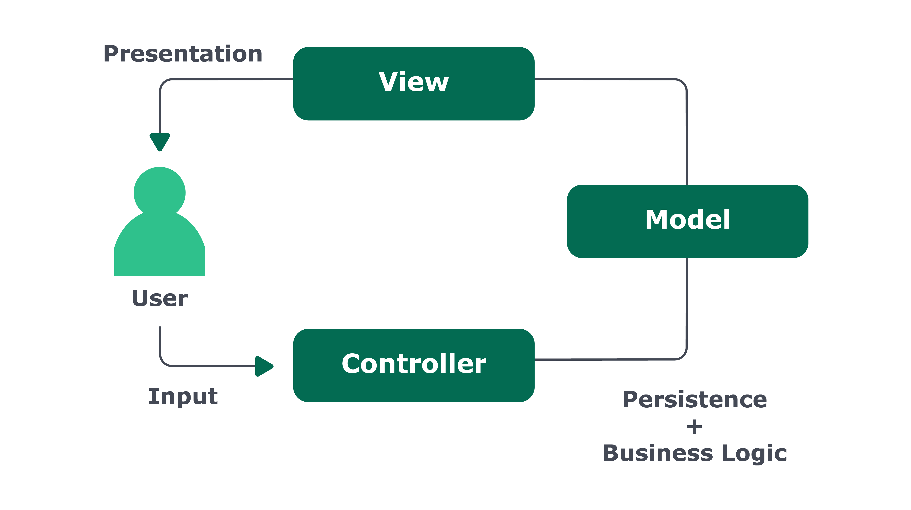

# Bloco 30 - Sockets

## Arquitetura de Software - Camada de View

## O que é MVC?

- *Model-View-Controller*
- 1980, Xerox
- Código dividido em camadas

> Essa divisão permite que as regras de negócio fiquem longe da camada de apresentação, tornando possível uma maior reutilização de código.



> O que o MVC provê é um guia geral de como organizar uma aplicação que suporta interação com usuário.

> Apesar de agora estarmos falando no contexto do MVC o model ainda é onde nós manipulamos e definimos a estrutura dos nossos dados, sendo que todo acesso aos dados deve passar por essa camada. E o controller ainda é responsável por receber as requisições e enviar as respostas, mas agora ele faz a ponte entre a view e o model , recebendo as ações da view e decidindo o que deve ser mostrado para a pessoa realizando a ação, após consultar o modelo, se necessário.

**Model fica responsável pelas regras de negócio.**

## View

> A view é a camada de apresentação, ou seja, a parte que tem contato com a pessoa que está usando nosso sistema. Serve basicamente como input e output de dados. Ela é responsável por duas coisas: criar a visualização dos dados vindos do model e fornecer meios para que a pessoa possa interagir com o sistema.

> A view se comunica com o controller (recebendo ordens do que exibir e comunicando eventos que ocorrem à medida que a pessoa interage com o sistema) e com o model , recebendo os dados que deve apresentar.

> Em aplicações web, a view geralmente é uma página HTML , mas também pode assumir outros formatos, como JSON e XML .

## MVC com Express

- Uso de `template engine` na criação da `view`.

> Uma template engine permite a criação de HTML (ou outros tipos de documentos) de forma dinâmica. Ela nos permite inserir trechos de código dentro de um arquivo. A engine então é capaz de reconhecer e executar esses códigos embutidos e de substituir o que for retornado por esse código no arquivo, criando assim um documento dinâmico.

### EJS - Embedded Java Script

- Permite embutir JavaScript nos documentos.
- **Instalação**
```
 npm install ejs
```
- Arquivos com a extensão `.ejs`.
- Exemplo `views/authors/index.ejs`
```html
<!doctype html>
<html>
  <head>
    <title>MVC - Exemplo</title>
  </head>
  <body>
    <ul>
      <% authors.forEach((author) => { %>
        <li><%= author.name %></li>
      <% }) %>
    </ul>
  </body>
</html>
```

- `<%` ... `%>`
  * **Não** é embutido no código.
  * Retorno ignorado.
- `<%=` ... `%>`
  * É embutido o retorno no código.

* **Configuração**
  - Necessário alterar o index do *express*.
```javascript
// const express = require('express');

// const authorController = require('./controllers/authorController');

// const app = express();

app.set('view engine', 'ejs');

app.set('views', './views');

// app.get('/authors', authorController.listAuthors);

// const PORT = process.env.PORT || 3000;

// app.listen(PORT, () => {
//   console.log(`Ouvinndo a porta ${PORT}`);
// });
```

* **Definindo o retorno**
  - utiliza-se o método `.render`, com os parâmetros da página e do conteúdo.
  ```javascript
  // const Author = require('../models/Author');

  // const listAuthors = async (req, res) => {
      const authors = await Author.getAll();

      res.status(200).render('authors/index', { authors });
  // };

  // module.exports = {
  //  listAuthors
  // }
  ```
> A linha `app.set('view engine', 'ejs');` configura o express para utilizar o EJS por padrão como template engine . Dessa forma, não precisamos especificar a extensão do arquivo que queremos utilizar.

> A linha `app.set('views', './views');` adiciona o diretório `/views` à lista de diretórios em que o expresss vai procurar um arquivo com o nome especificado pelo método render . Assim, não precisamos especificar o caminho completo do arquivo em todos os momentos.

> No controller, tudo que precisamos fazer é chamar `res.render` , passando o caminho do arquivo. Os dados necessários para renderizar o template são passados como um objeto no segundo parâmetro. Como o JavaScript que embutimos na view espera que exista uma variável `authors` , passamos nesse objeto uma propriedade `authors` contendo a lista de escritores.

* **Permitindo acesso ao `body` da requsição**
  * Funciona de maneira similar ao `bodyParser` normal.

  ```javascript
  app.use(bodyParser.urlencoded({ extended: true }));

  // Ou

  app.use(express.urlencoded({ extended: true }))
  ```

## Links

- [Ruby on Rails](https://rubyonrails.org/)
- [Cake PHP](https://cakephp.org/)
- [Template engine suportadas pelo Express](https://expressjs.com/en/resources/template-engines.html)
- [Template EJS](https://ejs.co/)

- [O que é MVC?](https://tableless.com.br/mvc-afinal-e-o-que/)
- [Introdução ao Padrão MVC](https://www.devmedia.com.br/introducao-ao-padrao-mvc/29308)
- [Software Architecture Guide - Martin Fowler](https://martinfowler.com/architecture/)
- [Arquitetura Multicamadas](https://pt.wikipedia.org/wiki/Arquitetura_multicamada)
- [Como estruturar uma aplicação em Node com MVC](https://vizir.com.br/2016/06/como-estruturar-uma-aplicacao-node-js/)
- [Embedded JavaScript templating.](https://ejs.co/)