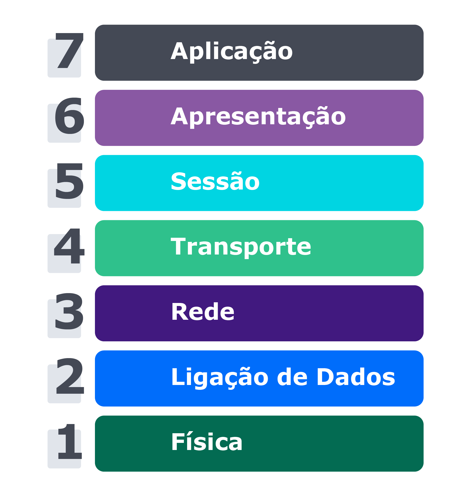
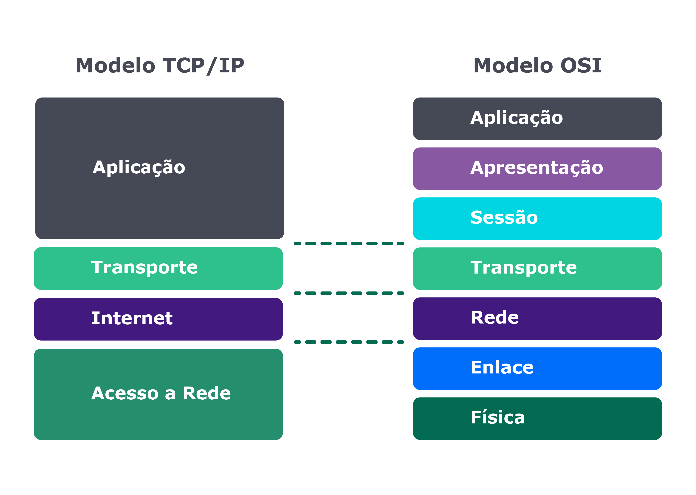

# Bloco 30 - Sockets

## Sockets - TCP/UDP & NET

> Um socket é um mecanismo de comunicação usado normalmente para implementar um sistema de cliente e servidor, sendo o cliente quem requisita um serviço e servidor quem executa esse serviço, assim como as APIs, que permitem a troca de mensagens entre máquinas/aplicações.

- *socket stream*: Via TCP
- *socket dgram*: Via UDP

## Modelo de camadas OSI

- *Open System Interconnection*
- [ISO](http://www.inmetro.gov.br/qualidade/responsabilidade_social/o-que-iso.asp) - *International Organization for Standardization* padroniza.

> O modelo OSI funciona através de uma pilha de protocolos, onde cada camada definine uma parte da comunicação entre as máquinas. Todas as ações necessárias para que ocorra a interconectividade dos dispositivos, no modelo OSI, foram divididas em sete camadas, nomeadas criativamente de 1 a 7:



1. Física
  > É a camada que estabelece a comunicação real entre os dois dispositivos por meio físico, seja através do cabo de internet, seja através de onda de radiofrequência, como por exemplo a wifi, dentre outras.

2. Enlace (ligação/link de dados)
  > Faz o controle de fluxo da transmissão dos dados, detectando e corrigindo erros do nível físico como instabilidades, interferências, e recebe/passa tudo para a camada física.

3. Rede
  > Realiza o endereçamento/mapeamento dos dispositivos na rede, ou seja, quais os caminhos que as informações devem percorrer desde a origem até o destino.

4. Transporte
  > A camada de transporte garante a confiança do pacote, o qual chegará na máquina com todos os dados necessários e enviados, sem perdas, erros ou duplicidade, além de obedecerem a uma sequência lógica. A unidade dessa camada é o segmento, e os protocolos de transporte são o TCP e o UDP.

5. Sessão
  > É responsável por manter o controle de quando iniciar, gerenciar e terminar a conexão entre os hosts . Ou seja, é essa camada que controla as duas ou mais máquinas que estão se comunicando.

6. Apresentação
  > Esta camada realiza a conversão dos formatos dos dados, de forma que sejam utilizados na transmissão. Há a compressão e criptografia para que o receptor possa entender os dados.

7. Aplicação
  > É com essa camada, que são os softwares, que nós, desenvolvedores/usuários, interagimos no nosso dia a dia. Essa camada é, basicamente, a interface com que interagimos. É nela que o HTTP, SMTP, FTP etc. atuam.

> O funcionamento, no dispositivo emissor, é da camada 7 até a 1. A camada de cima (7) vai passar dados para a de baixo (6), que fará o chamado "encapsulamento" dos dados, acrescentando informações de controle que dizem respeito a ela.

> Assim, vai ocorrendo o encapsulamento dos dados camada a camada, da 7 para a 1. Começamos com dados e terminamos com bits, que serão transmitidos pelo meio físico (camada 1).

> Quando a informação chega ao dispositivo de rede receptor ocorre o processo inverso, conhecido como "desencapsulamento". Os bits recebidos passam de camada para camada até se tornarem dados novamente.



## TCP/IP

- Implementa o modelo *OSI*.
- Composta por 4 camadas. (5, 6 e 7 do *OSI* foram mescladas)
> Já as camadas 3 e 4 do modelo OSI são similares às camadas 2 e 3 do TCP/IP, inclusive a camada de transporte do TCP/IP tem o mesmo nome, porém a camada 3 do modelo OSI (rede) no TCP/IP é chamada de "Internet".

- Camadas 1 e 2 tambem foram mescladas.

> No TCP/IP não costumamos nos referir pelos números das camadas e sim pelos nomes delas, pois quando nos referimos pelo número da camada estamos falando do modelo OSI.

## TCP e UDP

- Numa máquina existem, teoricamente, 65.536 (2 elevado a 16) portas **TCP**.
- E outras 65.536 **UDP**.

- **TCP**
  * Pré-acordo: *Three Way Handshake* ( *SYN* , *SYN-ACK* , *ACK* )
  > A máquina que está requisitando conexão à outra manda um pedido de sincronização (SYNchronize); a máquina receptora confirma esse recebimento (ACKnowledge) e responde com seu pedido de sincronização (SYNchronize), que é respondido pela máquina requisitante com uma confirmação (ACKnowledge).

  ```
  Cliente: SYN Quero me conectar!
  Servidor: ACK Mensagem recebida!
  Servidor: SYN Vamos nos conectar!
  Cliente: ACK Mensagem recebida!
  ```

- **UDP**
  * Sem garantia de entrega dos pacotes.
  * Mais rápido.
  > Basicamente, usando UDP, uma máquina emissora envia uma determinada informação e a máquina receptora recebe essa informação, não existindo qualquer confirmação dos pacotes recebidos. Se um pacote se perder não existe solicitação de reenvio, pois o protocolo não foi programado para fazer isso.

## Sockets TCP

> Sockets são uma abstração para endereços de comunicação através dos quais as máquinas se comunicam. Cada endereço tem um identificador único, composto pelo endereço da máquina e o identificador local da porta usado pelo processo/software. Ou seja, o endereço é o nosso próprio IP, e a porta é a porta que conhecemos, `127.0.0.1:3000` , ou `localhost:3000` .

- IP identifica a máquina.
- Porta identifica a aplicação.

> O servidor tem uma aplicação que é posta em uma determinada porta e aguarda por conexões nessa porta. O cliente deve saber previamente qual o nome ou IP do servidor e a respectiva porta onde a aplicação foi colocada à espera de conexões. Por fim, o cliente solicita uma conexão ao host (servidor)

> Se nenhum problema ocorrer, o servidor aceita a conexão e gera um socket em uma porta vaga no servidor, fazendo com que a porta original fique livre para poder receber outros pedidos de conexão.

> Tipicamente, o comportamento do servidor é ficar em loop, aguardando novas ligações e “gerando” sockets para atender às solicitações de clientes.

## CODE

- **SERVER**
```javascript
/* Importando o pacote NET, responsável pela implementação dos sockets no Node. */
const net = require('net');

/* Criando o servidor com o método 'createServer', onde recebe uma conexao na qual são expostos os eventos que podemos manipular no nosso servidor. */
const server = net.createServer((connection) => {
  console.log('Cliente conectado');

  /* Assim como um evento normal do Node.js, o método ".on()" escuta um evento em específico e, quando ele é ativado, nossa função de callback é chamada. */
  connection.on('end', () => {
    console.log('Cliente desconectado');
  });
  /* Nessa conexão que foi aberta, podemos fazer várias coisas. Uma delas é escrever/devolver uma mensagem para o cliente. */
  connection.write('Mensagem do servidor!\r\n');
  connection.pipe(connection);
});

/* Após termos programado o servidor, é só colocá-lo de pé */
server.listen(8080, () => {
  console.log('Servidor escutando na porta 8080');
});
```

- `close`
  * "hadError": `<boolean> | true` , se o socket tiver um erro de transmissão;
  * Emitido quando o soquete estiver totalmente fechado. O argumento "hadError" é um booleano que indica se o soquete foi fechado devido a um erro de transmissão.
- `connect`
  * Emitido quando uma conexão de soquete é estabelecida com sucesso.
- `data`
  * `<Buffer> | <string> ;`
  * Emitido quando os dados são recebidos. O argumento "data" será um Buffer ou String. A codificação de dados é definida por `socket.setEncoding()` ;
  * Os dados serão perdidos se não houver um ouvinte quando um socket emitir um "data" evento.
- `drain`
  * Emitido quando o buffer de gravação fica vazio. Pode ser usado para acelerar envios;
  * Consulte também: os valores de retorno de `socket.write()` .
- `end`
  * Emitido quando a outra extremidade do socket envia um pacote "FIN", finalizando assim o lado legível do socket.
  * Por padrão (allowHalfOpen é false), o socket envia um pacote FIN de volta e destrói seu descritor de arquivo depois de gravar sua fila de gravação pendente. No entanto, se allowHalfOpen estiver definido como true, o socket não terá automaticamente o "end()", seu lado gravável, permitindo que o usuário grave quantidades arbitrárias de dados. O usuário deve ligar o end() explicitamente para fechar a conexão (isto é, enviar um pacote FIN de volta).
- `error`
  * `<Erro>;`
  * Emitido quando ocorre um erro. O evento "close" será chamado diretamente após esse evento.
- `lookup`
  * Emitido após resolver o nome do host, mas antes de conectar. Não aplicável a sockets Unix;
  * "err": `<Erro> | <nulo>` é o objeto de erro;
  * "address": `<string>` é o endereço IP;
  * "family": `<string> | <null>` é o tipo de endereço;
  * "host": `<string>` é o nome do host.
- `ready`
  * Emitido quando um socket está pronto para ser usado;
  * Disparado imediatamente depois do 'connect'.
- `timeout`
  * Emitido se o socket exceder o tempo de inatividade. Isso é apenas para notificar que o socket está ocioso. O usuário deve fechar manualmente a conexão.

- **CLIENT**
```javascript
const net = require('net');
/* Através do pacote NET, nós podemos não só criar servidores como podemos conectar nossos clientes aos servidores */
const client = net.connect({ port: 8080 }, () => {
  console.log('Cliente conectado ao servidor!');
});

/* Assim como no servidor, também temos eventos do lado do cliente, onde o evento 'data' é ativado quando o servidor envia uma mensagem para o cliente. */
client.on('data', (data) => {
  console.log(data.toString());
  client.end();
});

/* Quando a conexão é interrompida/terminada, é ativado o evento 'end', onde podemos limpar alguns caches, dar uma mensagem para usuário, atualizar algum dado no banco de dados etc. */
client.on('end', () => {
  console.log('Desconectado do servidor');
});
```

## Links

- [Documentação Net](https://nodejs.org/api/net.html#net_event_close_1)
- [Como criar um chat usando sockets no Node.js](https://scotch.io/@devGson/building-a-tcp-chat-server-with-node332)
