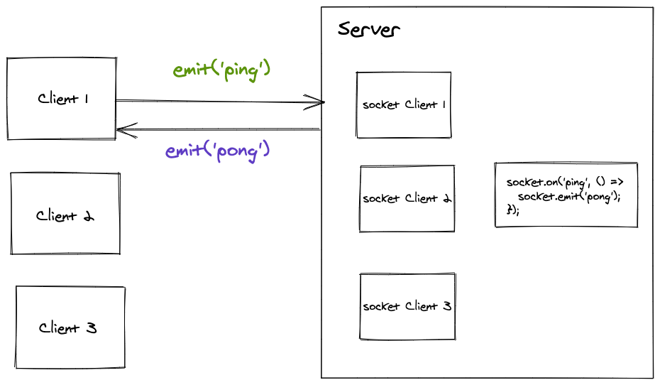
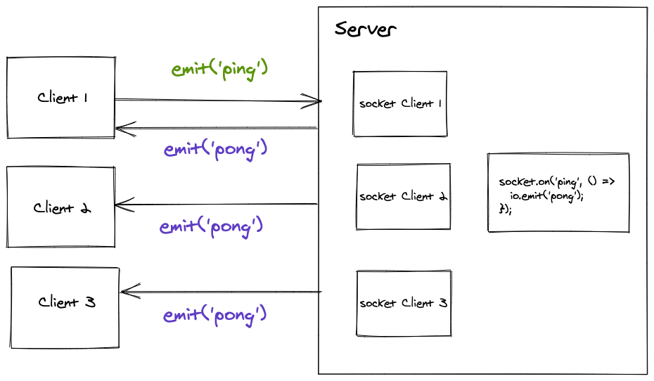
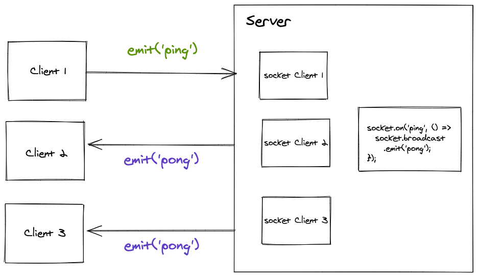
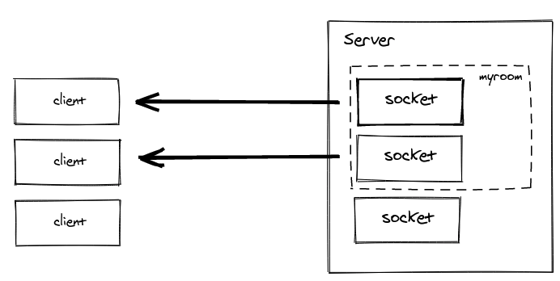

# Bloco 30 - Sockets

## Sockets - Socket.io

## O que é o Socket.IO?

> Socket.IO é uma implementação para comunicação via sockets, mas mais importante que isso é ele oferecer a possibilidade de se ter um `fallBack` : uma *feature* de contingência para quando seu client/server não estiver disponível.

- Funciona por meio de eventos no NodeJS.

> Ele tem muito uso em aplicativos de mensagens instantâneas, análise e monitoramento em tempo real e também streaming e colaboração em documentos.

> "o Socket.io realmente usa o WebSocket como transporte quando possível. Contudo, um cliente WebSocket não poderá se conectar a um servidor Socket.io, e um cliente Socket.IO não poderá se conectar a um servidor WebSocket"

- Se comporta como *WebSocket*, porém **não é um**.

## Configurando

- **Instalalção**
```
 npm install socket.io
```

- **Configuração no `index.js`**
```javascript
// const express = require('express');
// const app = express();
// const http = require('http').createServer(app);

const io = require('socket.io')(http, {
  cors: {
    origin: 'http://localhost:3000', // url aceita pelo cors
    methods: ['GET', 'POST'], // Métodos aceitos pela url
  }});

io.on('connection', (socket) => {
  console.log(`Usuário conectado. ID: ${socket.id} `);
});

// app.get('/', (req, res) => {
//   res.sendFile(__dirname + '/index.html');
// });

// http.listen(3000, () => {
//   console.log('Servidor ouvindo na porta 3000');
// });
```
  * Função `socket.io` recebe dois parâmetros:
    1. Objeto HTTP que é um servidor HTTP.
    2. Um objeto `options` para definir a regra de CORS para definir que vamos aceitar conexões do cliente que acessar pela URL http://localhost:3000 usando verbos GET e POST.
  * `io.on('connection')` : Executada sempre que um novo cliente se conectar.
    - O `socket`, passado como parâmetro, é a representação de uma conexão aberta ao socket-io, rodando no back-end.

- **Configurando no Front (`index.html`)**
  * Utiliza o [CDNJS](http://cdnjs.com/), que possibilita o uso da biblioteca `socket.io` no brack. [Link](https://cdnjs.cloudflare.com/ajax/libs/socket.io/3.0.4/socket.io.js)
  > Se você prefere não usar a versão da biblioteca via CDN, você consegue encontrar um arquivo local assim que baixar o módulo do socket.io . Você terá acesso ao arquivo de que precisa no seguinte caminho: `/socket.io/socket.io.js` .
  ```javascript
  <script src="/socket.io/socket.io.js"></script>
  ```
```html
<!DOCTYPE html>
<html>
  <head>
    <title>Socket.IO - trybe</title>
  </head>
  <body>
    <script src="/socket.io/socket.io.js"></script>
    <script>
      const socket = io();

    </script>
  </body>

</html>
```
  * `const socket = io();` Global. Executa uma conexão, quando chamada.
    - Por *default*, recebe por parâmetro o mesmo *endpoint* por onde está sendo acessado. Alternativa: `const socket = io('http://localhost:5000')`
  * Toda ver que uma nova conexão é aberta, o back-end roda a função: `io.on('connection')`
  > Obs.: Uma conexão socket tem um ciclo de vida que começa quando um socket é aberto e encerrado quando o socket é fechado, geralmente ao fechar ou recarregar uma página.

### CRIANDO EVENTOS

- Todos os eventos devems er criados, no back-end, dentor de `connection`.

```javascript
// ...

// io.on('connection', (socket) => {
// console.log(`Usuário conectado. ID: ${socket.id}`);

  socket.on('ping', () => {
    console.log(`${socket.id} emitiu um ping!`);
  });
// });

// ...
```
- Para criar um evento personalizado, basta colocar o nome do evento como primeiro parâmetro do `socket.on`.
- Cria um *listener*.
- No front:

```html
<!DOCTYPE html>
<html>
  <head>
    <title>Socket.IO - trybe</title>
  </head>
  <body>
    <button id='pingButton'>PING</button>
    <script src="/socket.io/socket.io.js"></script>
    <script>
      const socket = io();
      const button = document.querySelector('#pingButton');

      button.addEventListener('click', (e) => {
        socket.emit('ping');
        return false;
      });
    </script>
  </body>

</html>
```

### Enviando mensagens do back-end para o front-end

- Utilizando o método `emit()`.
```javascript
socket.emit('Nome do seu evento', {
  propriedade: 'Do seu objeto',
  enviado: 'Para o cliente da conexão atual'});
```
- Exemplo:
```javascript
// ...
// io.on('connection', (socket) => {
    socket.emit('ola', 'Que bom que você chegou aqui! Fica mais um cadin, vai ter bolo :)');

//  socket.on('ping', () => {
//    console.log(`${socket.id} emitiu um ping!`);
//  });
});
// ...
```

## Aprofundando no uso de socket.io

- `socket.emit`
  * DO lado do front: Envia uma mensagem para o back
  * Do lado do back: Transmite a mensagem **apenas** ao evento que disparou a `connection`

  

- `io.emit`
  * Transmite a mensagem para **todas** as `connection`

  

- `socket.broacast.emit`
  * Emite a mensagem para todas as conexões, menos a que disparou.
  ```javascript
  // module.exports = (io) => io.on('connection', (socket) => {
  //  socket.emit('serverMessage', 'Olá, seja bem vindo ao nosso chat público! Use essa página para conversar a vontade.');
      socket.broadcast.emit('serverMessage', `Iiiiiirraaaa! ${socket.id} acabou de se conectar :D`});
  // ...
  // });
  ```

  

- `socket.on('disconnect')`
  > Sempre que um cliente fecha ou recarrega a página, a conexão socket é encerrada e o socket.io dispara automaticamente um evento disconnect . É possível criar um listener específico para detectar quando uma conexão é encerrada.

  ```javascript
  // module.exports = (io) => io.on('connection', (socket) => {
    // ...

    socket.on('disconnect', () => {
      socket.broadcast.emit('serverMessage', `Xiii! ${socket.id} acabou de se desconectar! :(`);
    });
  });
  ```
  > Obs.: Nem sempre o navegador dispara o evento disconnect dependendo de como a página foi encerrada, para termos uma garantia que o socket vai realmente se desconectar, colo que o seguinte trecho de código no javascript do seu cliente.

  ```javascript
  //...
  window.onbeforeunload = function(event) {
    socket.disconnect();
  };
  ```

## Salas



- **Requisitando a entrada na sala (front-end)**
```javascript
const io = window.io();

const { username, room } = Qs.parse(location.search, {
  ignoreQueryPrefix: true});

socket.emit('joinRoom', { username, room });

const createMessage = (message) => {
  const messagesUl = document.querySelector('#messages');
  const li = document.createElement('li');
  li.innerText = message;
  messagesUl.appendChild(li);
}

socket.on('serverMessage', (message) => createMessage(message));
```

- **Recebendo a solicitação(back-end)**
```javascript
module.exports = (io) => io.on('connection', (socket) => {
  socket.on('joinRoom', ({ username, room }) => {
    socket.join(room);

    socket.emit('serverMessage', `Bem vindo ${username} a sala sobre ${room}`);

    socket.broadcast.to(room).emit('serverMessage', `${username} acabou de entrar na sala`);
  });
});
```
  * `socket.join`: sinaliza que o usuário se conectou a uma sala específica. Torna apto a receber mensagens que forem enviadas para essa sala.
  * `socket.broadcast.to`: Envia um evento para uma sala específica.
    > Dessa forma, garantimos que as mensagens enviadas nessa tela só chegarão para outros clientes que estiverem conectados na mesma sala.

- **Cliente enviando mensagens**
```javascript
socket.emit('joinRoom', { username, room });

const form = document.querySelector('form');
const inputMessage = document.querySelector('#messageInput');

form.addEventListener('submit', (e) =>{
  e.preventDefault();
  const message = inputMessage.value;
  socket.emit('roomClientMessage', { room, message });
  inputMessage.value = '';
  return false;
});
```
  - Envia a sala como parâmetro no `socket.emit`.

- **Servidor recebendo e repassando**
```javascript
// module.exports = (io) => io.on('connection', (socket) => {
//   socket.on('joinRoom', ({ username, room}) => {
//     socket.join(room);
//
//     socket.emit('serverMessage', `Bem vindo ${username} a sala sobre ${room}`);
//
//     socket.broadcast.to(room).emit('serverMessage', `${username} acabou de entrar na sala`);
//
       socket.on('roomClientMessage', ({ message, room}) => {
           io
             .to(room)
             .emit('serverMessage', `${username}: ${message}`)
         });
       });
// });
```
  - `io.to(room).emit(...)`: garante que as mensagens só sejam enviadas para a sala especificada.

## Cheatsheet

- `socket.emit` : Enviar uma mensagem apenas entre cliente <=> servidor que dispara um evento.
- `io.emit` : Enviar uma mensagem para todos os clientes com uma conexão socket aberta. (Só é possível usar do lado do servidor)
- `socket.broadcast.emit` : Enviar uma mensagem para todos os clientes exceto o cliente que disparou o evento. (Só é possível usar do lado do servidor)
- `socket.on('eventoCustomizado')` : Escutar um evento qualquer.
- `socket.on('disconnect')` : Escutar o evento disparado quando um usuário se desconecta.
- `socket.disconnect` : Força o encerramento de uma conexão socket.
- `socket.join` : Conecta um cliente a uma sala específica.
- `socket.broacast.to(x).emit` e `io.to(x).emit` : Funciona equivalente ao que já vimos anteriormente, porém enviando a mensagem apenas para os clientes que estiverem conectados a sala x .

* [Documentação](https://socket.io/docs/v4/)

## Links

- [pooling](https://sites.google.com/site/rmaalmeida/extra/tecnicasdepooling)
- [WebSocket](https://developer.mozilla.org/pt-BR/docs/WebSockets)
- [Tab Resize - split screen layouts](https://chrome.google.com/webstore/detail/tab-resize-split-screen-l/bkpenclhmiealbebdopglffmfdiilejc)
- [Documentação](https://socket.io/docs/v4/)
- [Documentação do Socket.io](https://socket.io/)
