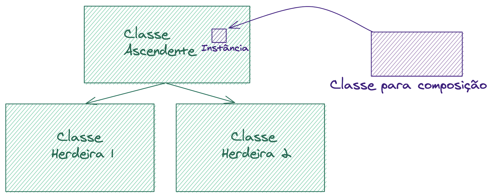

# Bloco 33 - Programação Orientada a Objetos e Padrões de Projeto

## Herança, Composição e Interfaces

- Elemento filho 'recebe' o pai como parâmetro, na **Herança**.
  `class SalesReportJSON(SalesReport):`

- Para declarar métodos abstrados, utilizar a notação `@abstractmethod`:
  ```python
  @abstractmethod
  def serialize(self):
      raise NotImplementedError
  ```

>Herança : é uma forma de especializar o comportamento de uma classe com outra classe;

>Classe Abstrata : uma classe que não pode ser instanciada. Utilizada para definir as funções comuns (nem sempre abstratas) e suas assinaturas;

>Métodos Abstratos : um método, ou função, que precisa ser implementado por uma classe herdeira para funcionar corretamente. Criado para definir uma Interface ;

>Interface : conjunto de métodos que um determinado objeto "possui" - ou, o conjunto de mensagens que um objeto é capaz de entender e responder para.

### Composição

- Classe recebe uma instância de outra classe para utilizar.
- **Inversão de dependência**

```python
from abc import ABC, abstractmethod
import gzip
import json
from zipfile import ZipFile


class ZipCompressor():
    ''' Nossos compressores terão fixado o local de salvamento
    do arquivo, então vamos defini-lo nos construtores'''
    def __init__(self, filepath='./'):
        self.filepath = filepath

    def compress(self, file_name):
        with ZipFile(file_name + '.zip', 'w') as zip_file:
            zip_file.write(file_name)


class GzCompressor():
    def __init__(self, filepath='./'):
        self.filepath = filepath

    def compress(self, file_name):
        with open(file_name, 'rb') as content:
            with gzip.open(file_name + '.gz', 'wb') as gzip_file:
                gzip_file.writelines(content)


class SalesReport(ABC):
    # Nossa classe agora espera *instâncias* de compressor como um parâmetro.
    # Temos um valor padrão para suportar o código que usava as SalesReport
    # sem parâmetros -- não precisa correr pra re-escrever nada ;)
    def __init__(self, export_file, compressor=GzCompressor()):
        self.export_file = export_file
        self.compressor = compressor

    def build(self):
        return [{
                'Coluna 1': 'Dado 1',
                'Coluna 2': 'Dado 2',
                'Coluna 3': 'Dado 3'
                },
                {
                'Coluna 1': 'Dado A',
                'Coluna 2': 'Dado B',
                'Coluna 3': 'Dado C'
                }]

    # Aqui temos um atributo de classe!
    FILE_EXTENSION = ''

    def get_export_file_name(self):
      # Aqui usamos o atributo de classe
      # Vai fazer mais sentido nas classes herdeiras!
      return self.export_file + self.FILE_EXTENSION

    def compress(self):
        self.serialize()
        self.compressor.compress(self.get_export_file_name())

    @abstractmethod
    def serialize(self):
        raise NotImplementedError


class SalesReportJSON(SalesReport):
    # Nós não reimplementamos o get_export_file_name
    # mas como ele usa um atributo de classe pra pegar a extensão
    # só de redefinir o atributo já vamos conseguir mudar o resultado!
    FILE_EXTENSION = '.json'

    def serialize(self):
        with open(self.get_export_file_name(), 'w') as file:
            json.dump(self.build(), file)


class SalesReportCSV(SalesReport):
    # Sua implementação vai aqui
    pass


# Para testar
relatorio_de_compras = SalesReportJSON('meu_relatorio_1')
relatorio_de_vendas = SalesReportJSON('meu_relatorio_2', ZipCompressor())

relatorio_de_compras.compress()
relatorio_de_vendas.compress()
```

> A Herança serve para especializar comportamentos, onde toda classe herdeira deve fazer tudo que a classe ascendente faz . Quando precisamos reusar código, ou os comportamentos começam a aparecer em somente algumas das classes herdeiras, prefira usar Composição ! Aí quem instância a classe escolhe com qual dependência (no nosso caso, o compressor) quer usá-la. O nome disso é Inversão de Dependência 😉. É uma inversão porque não é o autor da SalesReportJSON que define qual classe o método compress vai usar. Quem define é quem cria as instâncias da SalesReportJSON !



### Interface

- Classe se transforma em uma interface ao recebe um método abstrato.
- `@abstractmethod`

```python

# ...


class Compressor(ABC):
    def __init__(self, filepath='./'):
        self.filepath = filepath

    @abstractmethod
    def compress(self, file_name):
        raise NotImplementedError


class ZipCompressor(Compressor):
    def compress(self, file_name):
        with ZipFile(file_name + '.zip', 'w') as zip_file:
            zip_file.write(file_name)


class GzCompressor(Compressor):
    def compress(self, file_name):
        with open(file_name, 'rb') as content:
            with gzip.open(file_name + '.gz', 'wb') as gzip_file:
                gzip_file.writelines(content)
```

### Métodos estáticos

- `@classmethod`
- `@staticmethod`

```python
from abc import ABC, abstractmethod
import gzip
import json
from zipfile import ZipFile


class Serializer(ABC):
    @abstractmethod
    def serialize(cls, data):
        raise NotImplementedError


class ZipCompressor(Serializer):
    FILE_PATH = './'

    '''Um método de classe é chamado diretamente da classe,
    sem uma instância, e ACESSA algum atributo ou método da classe!'''
    @classmethod
    def compress(cls, file_name):
        '''Repare que, acima, o atributo cls é como o self: o
        cls é a própria classe, passada automaticamente para
        um método de classe, enquanto o self é a instância'''
        with ZipFile(cls.FILE_PATH + file_name + '.zip', 'w') as zip_file:
            zip_file.write(file_name)


class GzCompressor(Serializer):
    '''Um método estático é chamado diretamente da classe,
    sem uma instância, e NÃO ACESSA nenhum atributo ou método da classe!'''
    @staticmethod
    def compress(file_name):
        '''Como métodos estáticos não acessam classe nem instância,
        o Python não dá a eles nenhum primeiro parâmetro'''
        with open(file_name, 'rb') as content:
            with gzip.open(file_name + '.gz', 'wb') as gzip_file:
                gzip_file.writelines(content)


class SalesReport(ABC):
    FILE_EXTENSION = ''

    def __init__(self, export_file, compressor=GzCompressor):
        self.export_file = export_file
        self.compressor = compressor

    def build(self):
        return [{
                'Coluna 1': 'Dado 1',
                'Coluna 2': 'Dado 2',
                'Coluna 3': 'Dado 3'
                },
                {
                'Coluna 1': 'Dado A',
                'Coluna 2': 'Dado B',
                'Coluna 3': 'Dado C'
                }]

    def get_export_file_name(self):
      return self.export_file + self.FILE_EXTENSION

    def compress(self):
        self.serialize()
        self.compressor.compress(self.get_export_file_name())


class SalesReportJSON(SalesReport):
    FILE_EXTENSION = '.json'

    def serialize(self):
        with open(self.export_file + '.json', 'w') as file:
            json.dump(self.build(), file)


class SalesReportCSV(SalesReport):
    # Sua implementação vai aqui
    pass


# Para testar
relatorio_de_compras = SalesReportJSON('meu_relatorio_1')
relatorio_de_vendas = SalesReportJSON('meu_relatorio_2', ZipCompressor)

relatorio_de_compras.compress()
relatorio_de_vendas.compress()
```

> Herança : é uma forma de especializar o comportamento de uma classe com outra classe;

> Classe Abstrata : uma classe que não pode ser instanciada. Utilizada para definir as funções comuns (nem sempre abstratas) e suas assinaturas;

> Métodos Abstratos : um método, ou função, que precisa ser implementado por uma classe herdeira para funcionar corretamente. Criado para definir uma Interface ;

> Interface : conjunto de métodos que um determinado objeto "possui" - ou, o conjunto de mensagens que um objeto é capaz de entender e responder para;

> Composição : incorporar em um objeto outro objeto, para compartilhar código de maneira eficaz;

> Métodos de classe : métodos que podem ser chamados diretamente pela classe definida, e não por sua instância, para definirmos quando instanciar um objeto dessa classe for desnecessário! Utilizam, obrigatóriamente, atributos ou métodos internos da classe em seu funcionamento;

> Métodos estáticos : como os métodos de classe, mas não utilizam nada de sua classe em seu funcionamento.

> **utilize herança para especialização de uma classe geral e composição para compartilhamento de código**

## Links

- [O que é UML e Diagramas de Caso de Uso: Introdução Prática à UML](https://www.devmedia.com.br/o-que-e-uml-e-diagramas-de-caso-de-uso-introducao-pratica-a-uml/23408)
- [UML - Examples by Types of Diagrams](https://www.uml-diagrams.org/index-examples.html)
- [Composition over inheritance - The MurderRobotDog taxonomy problem](https://medium.com/humans-create-software/the-murderrobotdog-taxonomy-problem-767eb1785731)
- [RailsConf 2015 - Nothing is Something](https://www.youtube.com/watch?v=OMPfEXIlTVE)
- [Live de Python - Composição e métodos mágicos](https://www.youtube.com/watch?v=MYaXUrmvrho)
- [Uncle Bob - The Principles of OOD](http://butunclebob.com/ArticleS.UncleBob.PrinciplesOfOod)
- [SOLID Object-Oriented Design by Sandi Metz](https://www.youtube.com/watch?v=v-2yFMzxqwU)