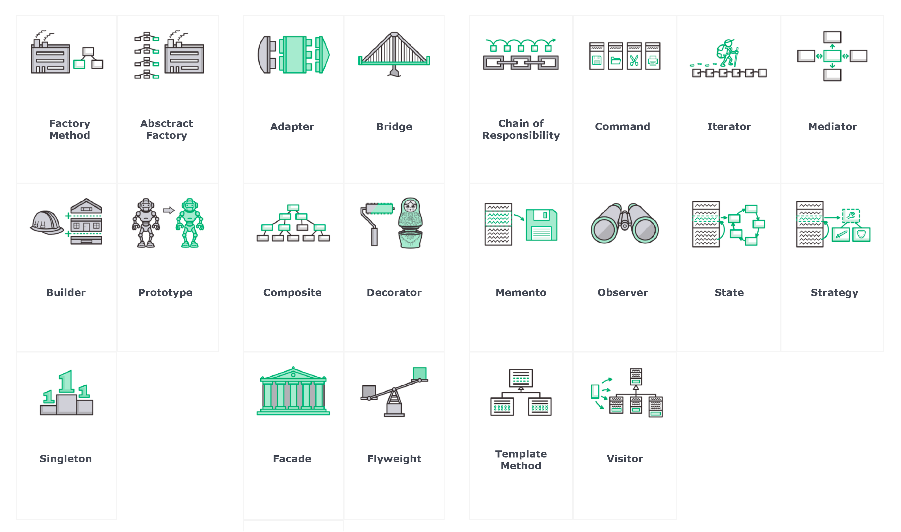
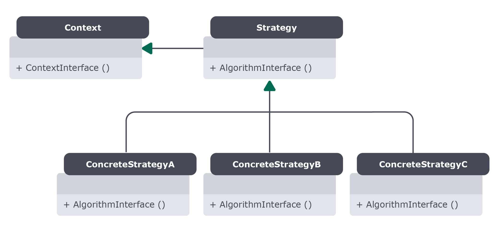

# Bloco 33 - Programação Orientada a Objetos e Padrões de Projeto

# Padrões de projeto

## Liskov Substitution Principle (Princípio de Substituição de Liskov)

> **L** iskov substitution principle ( Princípio de substituição de Liskov ): objetos em um programa devem ser substituíveis por outros de suas classes herdeiras, sem que isso quebre nada. Isso significa que, para a substituição ser possível, os subtipos devem seguir a interface de um tipo base;

> Ou seja, classes herdeiras devem sempre respeitar a interface de suas classes ascendentes! Elas podem especializar comportamentos, mas nunca removê-los! Caso contrário seu código fica cada vez mais difícil de usar, reusar e entender o que se faz! Agora, a Bia continuará fazendo suas chamadas da mesma forma, sem refatorar seu código. Esta é a parte legal da orientação a objetos bem feita!

### Exemplo de refatoração

```python
import pysql  # Encare essa lib como fictícia!

class SqlConnector:
    # ...

    def __init__(self, address, port):
        print(f'criada uma conexão em {address}:{port}')
        self.db = pysql.connect(address, port)

    def get_count(token):
        query = f'SELECT count FROM access WHERE token={token};--'

    def count_request(token):
        query = f'UPDATE access SET count = count+=1 WHERE token={token};--'
        self.db.execute(query)
```

```python
import pyredis  # Encare essa lib como fictícia também!

class RedisConnector:
    def __init__(self, address, port):
        print(f'criada uma conexão em {address}:{port}')
        self.db = pyredis.connect(address, port)

    def get_count(token):
        result = self.search(token)
        amount = result.get("access_count", None)
        return amount

    def update_count(token):
        amount = self.get_count()
        if amount is None:
            self.db.insert({token:1})
        else:
            self.db.insert({token: amount+1})
```

* Ambas classes podem herdar os métodos de uma única

```python
from abc import ABC, abstractmethod

class Connector(ABC):
    @abstractmethod
    def get_count(token):
        pass

    @abstractmethod
    def count_request():
        pass

class RedisConnector(Connector):
    def __init__(self, address, port):
        # A lógica da conexão ao banco Redis

    def get_count(token):
        # A lógica de acesso ao banco Redis

    def count_request(token):
        # A lógica de acesso ao banco Redis

class SqlConnector(Connector):
    def __init__(self, address, port):
        # A lógica da conexão ao banco SQL

    def get_count(token):
        # A lógica de acesso ao banco SQL

    def count_request(token):
        # A lógica de acesso ao banco SQL
```

## Interface Segregation Principle

```python
''' ABC é uma Abstract Base Class. Herdar desta classe indica que estamos fazendo
uma classe abstrata, que neste caso também é uma Interface, pois não contem
implementações, apenas definições de métodos.

Estes metodos DEVEM ser implementados pelas classes herdeiras, por isso
utilizamos o decorator `@abstractmethod`: se estes metodos não forem sobrescritas por
uma implementação da classe herdeira, o Python nos avisará que estamos cometendo um erro.'''

from abc import ABC, abstractmethod

class ReadOnlyConnector(ABC):
    @abstractmethod
    def get_count(self, token):
        pass

# Como FullConnector deve também ser capaz de ler,
# ela é uma classe abstrata que herda de outra classe abstrata!
class FullConnector(ReadOnlyConnector):
    @abstractmethod
    def count_request(self, token):
        pass

## Uma classe abstrata exige a implementação de todos os seus métodos.
## Uma implementação incompleta não poderá ser instanciada!
## class SQLConnector(FullConnector):
##     def count_request(self, token):
##         ...
##
## TypeError: não pode instanciar porque não implementa o método get_count
## sql = SQLConnector() 
```

> Esta divisão de tarefas onde cada interface tem a responsabilidade de representar uma única característica é chamada de Princípio De Segregação de Interfaces , ou em inglês, Interface Segregation Principle. Justamente o I dos nossos princípios S.O.L.I.D.!

* S - Single Responsability Principle - Princípio da Responsabilidade Única
* O - Open/Closed - Aberto para extensão, fechado para modificação
* L - Liskov's Substitution Principle - Principio da Substituição de Liskov
* I - Interface Segregation Principle - Principio da Segregação de Interfaces
* D - Dependency Inversion - Inversão de Dependências (ou: use composições!)

## Padrões de Projeto

> Padrão de Projeto é uma solução geral para um problema que ocorre com frequência dentro de um determinado contexto no projeto de software . Desde a década de 70, cientistas da computação perceberam que, ainda que em contextos diferentes, algumas soluções de problemas se repetiam em vários softwares . Visando facilitar a reutilização do desenho da solução e a comunicação, assim como melhorar a documentação e compreensão de um sistema, essa comunidade de cientistas começou a catalogar estes padrões.



> O exemplo do iterator é um exemplo mais básico do que padrões de projeto são, mas ilustra bem o seu propósito: organizar seu código e raciocínio de formas eficazes, comprovadamente boas e (praticamente) universalmente aceitas. Ao se deparar com um determinado problema que se encaixa na definição de um padrão de projeto, busque o padrão de projeto para saber uma forma boa de resolver esse problema.

### Iterator

```python
class DatabaseIterable:
    def __init__(self, sql_connector, query_template):
        self.db = sql_connector
        self.query_template = query_template

    def get_page(self, page):
        return self.db.get(query=self.query_template, page=page)

    def __iter__(self):
        """Aqui iniciamos a iteração, retornando um objeto DatabaseIterator
        como Iterador."""

        return DatabaseIterator(self.db)


class DatabaseIterator:
    def __init__(self, sql_connector):
        """No construtor da classe iteradora definimos o valor inicial do
        contador current_page, e também o(s) atributo(s) que será(ão)
        responsável(is) por armazenar/acessar a coleção de dados pela qual
        queremos iterar."""

        self.db = sql_connector
        self.current_page = 0

    def __next__(self):
        """Este método busca no banco de dados a página que queremos e
        incrementa o contador current_page, para retornarmos a próxima página
        na próxima vez que o método for chamado."""

        data = self.iterable.get_page(page=self.current_page)

        """É uma boa prática a utilização da exceção StopIteration() para
        indicar que não foi possível avançar na iteração. Ou seja: tentamos
        acessar uma current_page que não existe."""

        if not data:
            raise StopIteration()

        self.current_page += 1
        return data
```

> O padrão iterator é aplicado para facilitar e unificar a resolução de todos os problemas que encontrarmos que são similares a "preciso operar sobre vários elementos, mas um de cada vez". É implementado de várias formas em diferentes linguagens, sempre buscando facilitar a nossa vida.

```python
minhas_linguagens = ["javascript", "python", "C", "Go"]
for linguagem in minhas_linguagens:
    print("Eu sei programar em: ", linguagem)

lista_de_compras = open("compras.txt", "r")
for item in lista_de_compras:
    print("Eu devo comprar: ", item)
```

> No Python por exemplo, quando chamamos um for para iterar sobre um objeto, a linguagem envia para o mesmo a mensagem __iter__() , de modo a obter um iterador ; em seguida, envia para o iterador a mensagem __next__() para encontrar o próximo item, e o próximo, e o próximo... até o iterador se esgotar (levantar a exceção StopIteration() )! Assim, toda classe que implementar o padrão Iterator pode ser usado com estruturas como o for ! Listas, tuplas, dicionários, árvores, até arquivos.

* Possível implementação do código

```python
# Primeiro instanciamos o ITERÁVEL
post_paginator = DatabaseIterable(db, post_page_query_template)

# Em seguida podemos usar o for pra iterar
# o ITERADOR é criado implicitamente
for page in post_paginator:
    # faz algo com a pagina, que é uma lista de resultados
    for post in page:
        print(post['title'])
```

### Adapter

> Ele permite converter a interface de uma classe em outra interface, esperada pelo cliente (isto é, o código que usa a nossa classe). O Adapter permite que interfaces incompatíveis trabalhem em conjunto – o que, de outra forma, seria impossível.

- Exemplo:
  * A classe espera receber um dicionário (chave/valor), mas recebe duas listas, uma de cabeçalhos(chaves) e outra de valores.
  ```python
  from gerenciator3000 import ReportLoader

  loader = ReportLoader()
  print(loader.headers)   ##  ['id', 'date', ..., 'final_price']
  print(loader.rows[0])  ##  [1337, '2020-11-20', ..., 2350.5]
  ```

* A classe que utilizará os valores:
```python
class ReportAnalyzer:
    def __init__(self, loader):
        self.loader = loader

    def average(self):
        # este é um dos métodos que espera uma lista de dicionários
        data = self.loader.load_data()
        # aqui ela soma o valor na chave final_price em cada item da lista
        total = sum(order['final_price'] for order in data)
        return total / len(data)
    
    ...
```

* Adapter
```python
class G3000LoaderAdapter:
    # aqui o loader é uma instancia do gerenciator3000.ReportLoader!
    def __init__(self, loader):
        self.loader = loader
    
    def load_data(self):

        # o zip junta uma lista de chaves e uma lista de valores 
        # e cria um dicionário! por exemplo: 
        # zip(['nome', 'idade'], ['Capi', 34]) => {'nome': 'Capi', 'idade': 34}
        
        return [zip(loader.headers, row) for row in loader.rows] # tcharans
```

* Implementação:
```python
from gerenciator3000 import ReportLoader
from project.loaders import G3000LoaderAdapter
from project.analyzer import ReporterAnalyzer

# o loader da ferramenta é carregado do jeito que a ferramenta recomenda
g3000_loader = ReportLoader(...)
# o adaptador recebe o loader da ferramenta.
loader = G3000LoaderAdapter(g3000_loader)
# o analyzer do nosso sistema recebe o adaptador como qualquer outro loader.
analyzer = ReportAnalyzer(loader)

analyzer.average() # JUST WORKS (tm)
```

> Nossa aplicação aumenta em complexidade como consequência, pois estamos adicionando novas interfaces e classes, porém o desacoplamento entre o código do cliente e o objeto adaptado se mantém. Mudanças no objeto adaptado se refletem apenas no adaptador e não no código cliente, então você não altera nenhuma lógica para adicionar a funcionalidade. É possível substituir o serviço adaptado através da criação de novos adaptadores.

> Classes se comunicam através de troca de mensagens, porém nem sempre isso é possível de se fazer diretamente. Às vezes há uma incompatibilidade entre as classes (tipo uma classe esperar CSV e outra só enviar JSON!), seja por causa de um código legado ou contextos distintos. Em outras palavras, as classes precisam se comunicar, mas é difícil fazê-las "conversarem".

### Strategy

> Você tem uma tarefa que pode fazer de diversas formas diferentes. Por exemplo, compactar um arquivo de duas formas diferentes. Ou serializar um arquivo de duas formas diferentes! Ou invalidar cache de três formas diferentes! Em qualquer situação assim, onde você se imaginar fazendo um if para escolher qual algoritmo usar para fazer uma ação, você pode aplicar o padrão Strategy!



### Outros padrões


### Code Smells

* "Mau cheiro no código"
* Práticas que não dão problema de cara, mas a médio/longo prazo sim.
* Identificar códigos ruins.
* Saber quando refatorar.
* Exemplos:
  - Funções e classes grandes.
  - Comentários explicando o código.
  - Comentários 'guardando' códigos antigos
  - Duplicação de código

> Long Method : métodos grandes geralmente significam mais de uma responsabilidade em um mesmo trecho de código. Por isso, como regra geral, métodos não devem ser muito longos;

> Large Class : classes grandes geralmente significam mais de uma responsabilidade. Por isso, como regra geral, classes não devem ser muito grandes;

> Duplicate Code : códigos duplicados geralmente significam falta de abstração, ou seja, lógica repetida que poderia estar centralizada em uma única entidade compartilhada. Assim sendo, uma aplicação não deve ter trechos de código duplicados;

> Dead Code : se um código não está mais sendo utilizado, porque ainda está lá?

> Speculative Generality : quem nunca tentou adivinhar o futuro e tornou uma implementação mais complicada do que precisava? Essa aqui é extremamente comum de fazermos sem perceber!

#### Data Clumps

> Ocorre quando um grupo de variáveis (como o endereço de entrega do exemplo que veremos abaixo) é passado junto como parâmetro em várias partes do programa. É indicativo de que esses grupos devem ser transformados em suas próprias classes.

> Imagine que você tem um aplicativo para uma hamburgueria local, que só faz entregas na própria cidade. Nesta plataforma queremos registrar uma pessoa com seu nome e endereço para facilitar as entregas.

```python
class User:

    def __init__(self, name, street, number, district):
        '''Você nunca vai passar a rua sem passar também o número e o bairro!'''
        self.name = name
        self.address_street = street
        self.address_number = number
        self.address_district = district
```

* Solução

```python
class Address:
    def __init__(self, street, number, district):
        '''As informações que nunca vem separadas são uma entidade separada agora.'''
        self.street = street
        self.number = number
        self.district = district

class User:
    def __init__(self, name, address):
        self.name = name
        self.address = address
```

#### Middle Man

> Se uma classe somente delega uma ação para outra, por que deveria existir? Corte o intermediário!

```python
class Player:
    # ...

    def game(self, game_id):
        '''Busca um jogo da pessoa através do seu id'''
        return PlayerGame.query.filter(game_id=game_id, user_id=self.id).first()

    def tournaments(self, game_id):
        '''Aqui estamos buscando pelos jogos de uma pessoa para encontrar
        seus torneios.

        Ou seja, usamos o middle man PlayerGame para encontrar o torneio.
        O que além de adicionar complexidade de código, adiciona uma consulta
        extra ao banco de dados.
        '''
        return self.game(game_id).tournaments()


class PlayerGame:

    def tournaments(self):
        return Tournament.query.filter(game_id=self.game_id).all()


class Tournament:
    ...


# Código cliente
player = Player(id=1)
print(player.tournaments(1))
```

```python
class Player:

    # ...

    def tournaments(self, game_id):
        '''Aqui removemos o middle man PlayerGame da consulta,
        fazendo-a diretamente em Tournament.

        Com isso simplificamos o nosso código e removemos uma consulta.
        '''
        return Tournament.query.filter(game_id=game_id, user_id=self.id).all()


class Tournament:
    ...


# Código cliente
player = Player(id=1)
print(player.tournaments(1))
```

## Links

- [Livro Design Patterns](https://en.wikipedia.org/wiki/Design_Patterns)
- [Refactoring Guru](https://refactoring.guru/pt-br/design-patterns/)
- [Regras Linter](https://www.flake8rules.com/#pyflakes)

- [Site oficial do Redis](https://redis.io/)
- [Eduardo Mendes - Padrões de Projeto](https://www.youtube.com/watch?v=hVOP_XR9gEw&list=PLOQgLBuj2-3IPHFlBmqhtbM4vLJg9tob4)
- [Design Patterns](https://wiki.c2.com/?DesignPatterns)
- [Martin Fowler - Code Smells](https://martinfowler.com/bliki/CodeSmell.html)
- [Ana Paula Gomes - Code Smells & Refactoring – Who you gonna call?](https://youtu.be/f-3EKzjZ0KA)

