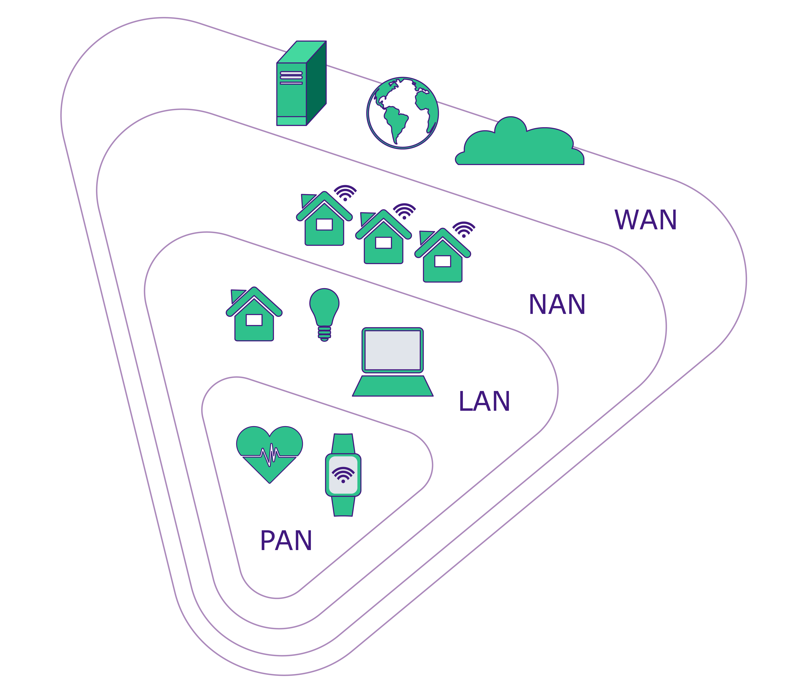
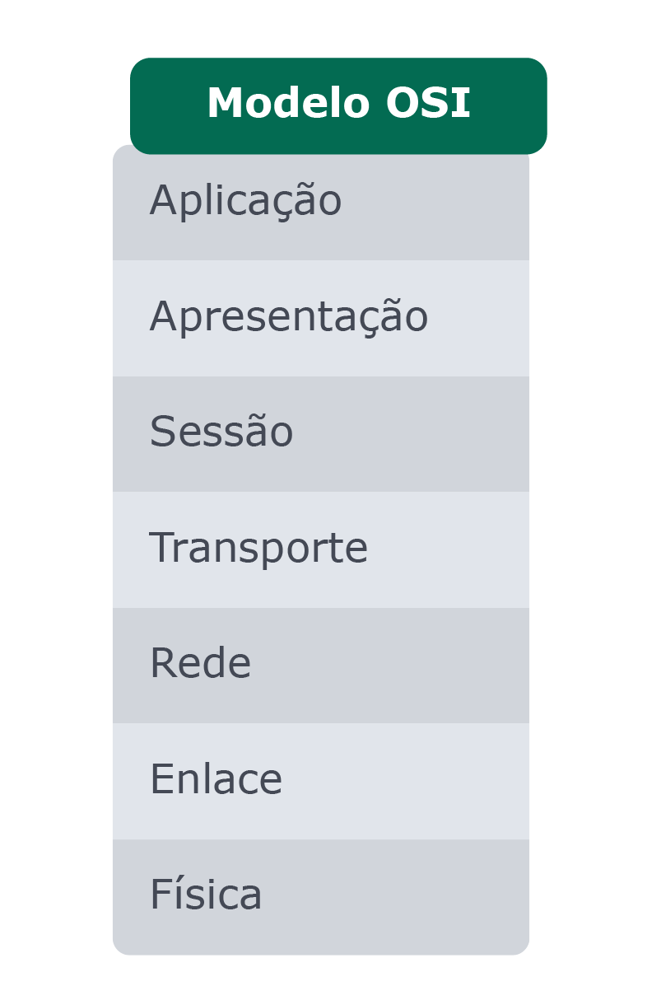
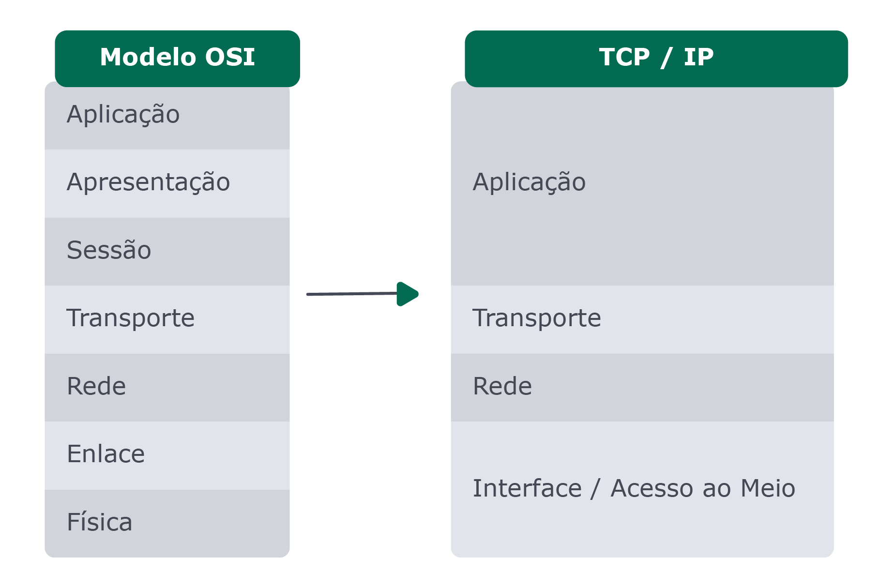

# Bloco 34 - Redes e Raspagem de Dados

# Arquitetura de redes

> Existe uma classificação quanto a escala dessa rede, sendo que uma rede de escala menor pode fazer parte de uma rede de escala maior:

> PAN (Personal Area Network): Chamamos de PAN as redes que abrangem uma pequena área física, com dispositivos que se comunicam de forma bem próxima. Como exemplo, temos a rede que permite que seu fone bluetooth se conecte com seu smartphone ou seu mouse sem fio funcione no seu computador.

> LAN (Local Area Network): Rede local de um escritório, casa ou prédio, normalmente abrangendo uma área com algumas salas ou blocos. Interliga computadores, roteadores, smartphones, impressoras, entre outros.

> MAN (Metropolitan Area Network): Interliga diversas redes e dispositivos em uma área metropolitana como, por exemplo, vários locais situados em diversos pontos de uma cidade ou bairro. Outra classificação é a NAN (Neighborhood Area Network), que se restringe a uma área de uma bairro ou vizinhança.

> WAN (Wide Area Network): Rede geograficamente distribuída, interligando redes e dispositivos em âmbito global (estados, países e continentes). A internet é um exemplo de WAN 😎

## Pacotes

> Para trafegar uma informação em uma rede, essa informação é convertida para binários e então dividida em diversos pedaços, e esses pedaços são os chamados "pacotes" que são enviados pela rede. Os pacotes possuem diversos dados, além da informação em si, como quem está enviando aquele pacote, qual o seu destino e indicações para que o destinatário saiba se alguma parte da informação se perdeu no caminho e se é necessário solicitar um reenvio, dentre outras funções.

## Protocolos

> Um protocolo é um conjunto de regras e ações a serem tomadas em uma determinada situação.

> De maneira semelhante, nas redes de computadores, os protocolos são conjuntos de regras que controlam como os dados são trocados. Dessa forma é possível que, ao enviar um dado (pacote) através da rede seguindo esses padrões, tenhamos a garantia de que os demais dispositivos da rede saberão lê-lo.

> Essa padronização é o que permite que diversos dispositivos sejam criados e produzidos a cada dia, todos capazes de se conectarem e trocarem informações com o mundo inteiro através das redes já existentes.

> Fazendo uma analogia, quando queremos passar uma mensagem para outra pessoa, a mensagem em si é a informação que queremos passar, as palavras são os pacotes e o idioma é o protocolo. É importante que os computadores estejam "se comunicando no mesmo idioma" e utilizando as palavras adequadamente para que se entendam, da mesma forma que nós humanos precisamos de regras para conseguirmos nos comunicar 

## Modelo de Rede

### Modelo ISO/OSI

> 1. Física: Estabelece a comunicação entre os dispositivos no sentido físico. Responsável pelo cabeamento, pelas características elétricas como tensão, ópticas (quando se der por meio óptico) ou eletromagnéticas em uma rede sem fio. Tudo isso garantindo que ocorra a transmissão dos dados pelos meios físicos (hardware), sem perder 0 s e 1 s.

> 2. Enlace: Também chamada de "link de dados", essa camada é responsável pela detecção e eventualmente pela correção de erros que tenham ocorrido no nível físico. Ela também realiza o controle do fluxo da transmissão entre um dispositivo e outro.

> 3. Rede: Responsável pelo endereçamento dos dispositivos na rede, assim como pela rota (caminho) que os pacotes deverão percorrer para chegarem da origem até destino.

> 4. Transporte: Responsável pela detecção e correção de erros que tenham ocorrido nas camadas anteriores, assim como pela ordenação, garantindo que os dados saídos da origem sejam os mesmos no destino. Além disso, ela define a conexão que será usada e como estabelecê-la, assim como controla o fluxo e congestionamento de dados.

> 5. Sessão: Responsável pela comunicação entre dois processos que estão em máquinas diferentes, controlando o status, definindo quando deve começar, terminar ou reiniciar a comunicação entre origem e destino.

> 6. Apresentação: Responsável pela conversão entre os formatos de caracteres para que possam ser utilizados na transmissão, também responsável pela compressão e criptografia desses dados.

> 7. Aplicação: Essa camada é responsável pelo controle da sintaxe e da semântica da mensagem, traduzindo de fato as informações trafegadas.

> A informação passa por uma primeira camada, sendo formatada e tendo informações adicionadas de acordo com sua regra. Em seguida, o resultado desse primeiro encapsulamento é passado para a outra camada, onde a informação é novamente tratada e são adicionadas as informações pertinentes àquela camada. Esse processo é repetido por todas as camadas até que os dados estejam aptos para serem trafegados ao seu destino.

> Da maneira inversa, o destinatário realiza o desencapsulamento, compreendendo os dados de cada camada e então prosseguindo para a camada seguinte.

## Modelo Internet - TCP/IP

> O modelo ISO/OSI, como o nome já diz, é um "modelo": isso quer dizer que ele define camadas abstratas a serem tratadas. É necessária, portanto, uma implementação que aplique esses conceitos. Uma das implementações desse modelo é a TCP/IP, que é um conjunto de protocolos de comunicação: TCP ( Transmission Control Protocol - Protocolo de Controle de Transmissão) e o IP ( Internet Protocol - Protocolo de Internet).

## Links

- [Documentação NodeJS - net | TCP](https://nodejs.org/api/net.html#net_net)
- [Documentação NodeJS - dgram | UDP](https://nodejs.org/api/dgram.html#dgram_udp_datagram_sockets)
- [Vídeo - Governança da Internet | nic.br](https://www.youtube.com/watch?v=ZYsjMEISR6E)
- [Vídeo - Desenvolvendo servidores TCP e UDP com NodeJS](https://www.youtube.com/watch?v=1acKGwbby-E)
- [Vídeo - Desenvolvendo servidores TCP e UDP com NodeJS | Vídeo completo](https://www.youtube.com/watch?v=qqRYkcta6IE)
- [Documentação NodeJS - http | HTTP](https://nodejs.org/api/http.html#http_http)
- [Artigo - O que é um backbone?](https://tecnoblog.net/277282/o-que-e-um-backbone/)
- [Artigo - Cabos submarinos](https://canaltech.com.br/telecom/cabos-submarinos-como-funciona-a-tecnologia-que-conecta-pessoas-e-continentes-133033/)
- [Vídeo - A história da Internet no Brasil - TecMundo](https://www.youtube.com/watch?v=k_inQhpKprg)
- [Comando telnet](https://www.linuxforce.com.br/comandos-linux/comandos-linux-comando-telnet/)
- [Comando nc](https://www.linuxforce.com.br/comandos-linux/comandos-linux-comando-nc/)
- [Comando wget](https://www.hostinger.com.br/tutoriais/wget-o-que-e-como-instalar-comandos-wget)
- [Comando cURL](https://www.hostinger.com.br/tutoriais/comando-curl-linux/)