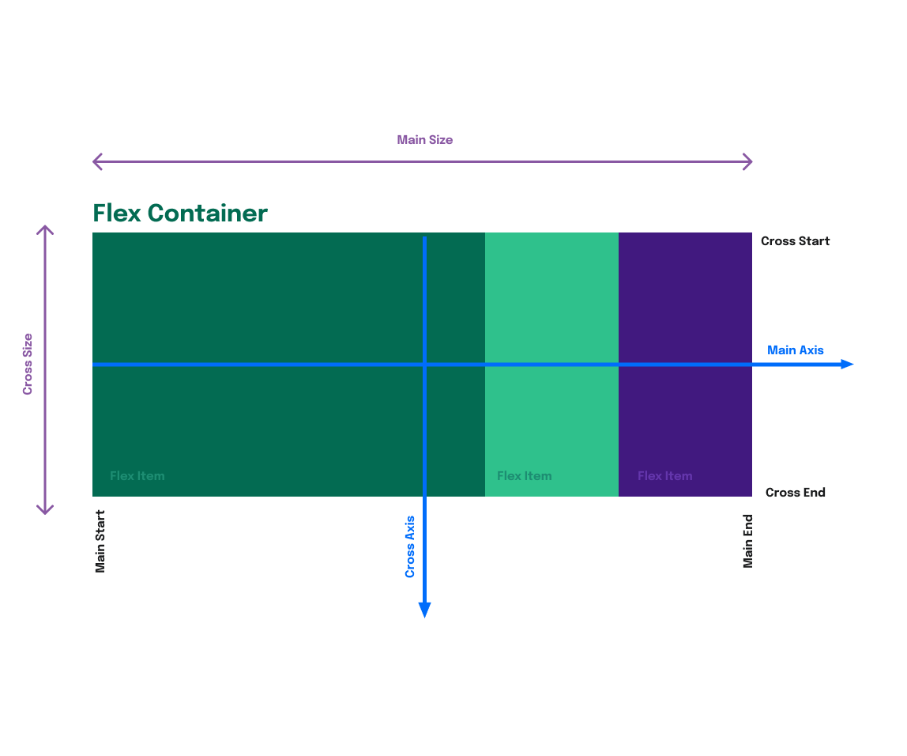

# Bloco 6 - HTML e CSS: Forms, Flexbox e Responsivo

## CSS Flexbox - Parte 1

### Introdução, estrutura básica, flex-direction, flex-wrap, flex-flow e reverse

```
display: flex;
```

- Importante diferenciar os eixos *Main Axis* (eixo principal) e *Cross Axis* (eixo transversal)



- `flex-direction`: Define o eixo principal (horizontal, vertical, inverso)
  - `row` padrão, horizontal, esquerda para direita.
  - `row-reverse` horizontal, direita para esquerda.
  - `column` vertical, de cima para baixo.
  - `column` vertical, de baixo para cima.
- `flex-wrap`: Define se os itens devem quebrar a linha ou não, seguindo o eixo transversal.
  - `nowrap` padrão, não quebra.
  - `wrap` quebra, conforme o eixo utilizado.
  - `wrap-reverse` quebra, conforme o eixo utilizado no sentido inverso.
- `flex-flow` : agrupamento do `direction` e `wrap`, nessa ordem.
